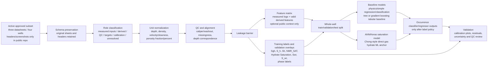

# Approved-Data Schema Coverage And Model Architecture Plan

Created: 2026-06-15

## Purpose

This document records the non-stability ML/schema/methodology layer for the
North Slope gas hydrates project. It is public-safe and source-backed by:

- `docs/NORTH_SLOPE_PROJECT_BASE.md`;
- `docs/WELL_LOG_REQUIREMENTS_MAP.md`;
- `docs/SCIENCE_TO_ML_LOGIC_LADDER.md`;
- `docs/ML_PIPELINE_BASELINE_SOURCE_LEDGER.md`;
- `docs/FULL_PROJECT_ML_WORKFLOW_DIAGRAM.md`;
- `data/public_stability_products/public_ml_target_registry_2026-06-15.csv`;
- `data/public_stability_products/public_ml_leakage_guardrails_2026-06-15.csv`.

It does not contain approved well-log rows, core rows, restricted identifiers,
trained models, model metrics, hydrate predictions, saturation estimates, or
final validation results.

## Current Data Position

The 2026-06-18 project update narrows the active near-term ML scope: the three
available approved datasheets/workbooks represent four wells, and those four
wells are the working model scope until the user or mentor verifies otherwise.
Older "about 3 of 71 datasets" language remains useful as historical schema
context, but it is not the current presentation or runtime target. The next
step is to verify the four well names/aliases, locations, log families,
core/NMR/pressure-core evidence, lithology, and hydrate-saturation labels.

The available headers and screenshots are enough to design schema roles,
leakage controls, and model architecture. They are not enough to train final
models, report performance, claim hydrate occurrence accuracy, or publish
saturation results.

The current public-safe deliverable is therefore:

```text
schema and model-architecture readiness
```

not:

```text
trained model results or final hydrate predictions
```

The schema-level coverage matrix is stored at:

```text
data/public_ml_products/approved_schema_coverage_matrix_2026-06-15.csv
```

The clearer field-role table for intake and website display is stored at:

```text
data/public_ml_products/approved_data_field_role_table_2026-06-15.csv
```

Companion method documents:

```text
docs/APPROVED_DATA_INTAKE_SPEC_2026-06-15.md
docs/FIRST_MODEL_EXPERIMENT_PLAN_2026-06-15.md
docs/MENTOR_DECISION_REQUESTS_2026-06-15.md
```

Runnable public-safe intake contract:

```text
dashboard/approved_data_intake.py
tests/test_approved_data_intake.py
data/public_ml_products/approved_data_intake_template_2026-06-15.csv
data/public_ml_products/approved_data_intake_validation_schema_2026-06-15.csv
data/public_ml_products/first_model_output_schema_2026-06-15.csv
```

## Header Preservation Rule

The approved-data workflow will preserve original sheet/file names and original
headers first. Canonical aliases are metadata used by loaders, validation,
feature engineering, and documentation. The project should not rename away
origin headers such as `Sgh`, `S_h`, `Sh`, `NMR_SAT`, `Rho_b`, `AO90`, `Vp`,
`Vs`, `Ratio Vp/Vs`, or `Depth_ft`.

Minimum metadata for each imported column:

| Metadata field | Reason |
|---|---|
| source file or sheet | Maintains provenance and supports workbook audit. |
| original header | Prevents loss of screenshot/workbook evidence. |
| canonical alias | Lets code normalize equivalent fields without hiding origin names. |
| role | Separates predictors, targets, QC, context, and unresolved fields. |
| unit status | Prevents feet/meters, g/cc/kg/m3, percent/fraction, or velocity/slowness mistakes. |
| leakage policy | Keeps answer-like fields out of the feature matrix. |
| unresolved question | Carries mentor/workbook decisions forward. |

## Schema Role Families

| Role family | Examples | Current use |
|---|---|---|
| measured input logs | `DEPTH`, `True Depth`, `Rho_b`, `RHOB`, `GR`, `Rt`, `RES`, `Vp`, `VELP`, `Vs`, `VS1`, `NMRPHI`, `phi_nmr`, `caliper`, `CAL1` | Candidate model inputs only after unit normalization, QC, and source review. |
| derived features | `Phi_porosity`, `phi_den`, `DPHI`, `Ratio Vp/Vs`, impedance, shale-volume proxy, resistivity transforms, elastic attributes | Candidate model inputs only when source curves and equations are valid. |
| QC and alignment fields | differential caliper, `Depth correspondence at ML data`, `depths_unitD`, `depths_unitC` | Filtering, downweighting, missingness flags, alignment audit, and whole-well split support. |
| target-only fields | `Sgh`, `S_h`, `Sh`, `NMR_SAT`, `Hydrate Saturation`, interpreted phase labels | Labels, calibration references, or validation overlays only. Never predictors. |
| calibration/reference fields | `Swr`, `S_wr`, core/NMR calibration references when approved | Calibration or comparison fields pending formula/provenance review. Fail closed if leakage is possible. |
| context features | public stability/admissibility context, regional assessment-unit context, source-control confidence | Optional context, masks, confidence labels, or reason flags only. Not hydrate labels. |
| unresolved fields | `AO90`/`A090`/`AF90` style resistivity mnemonics, sheet identity fields, unclear refined-sheet depth vectors | Excluded or held as metadata until workbook or mentor review resolves the role. |

## Approved-Data Field Role Table

The field-role table converts the current coverage matrix into a direct intake
contract. It uses these public-safe columns:

| Field | Use |
|---|---|
| `original_header` | Header exactly as visible in screenshots or schema notes. |
| `normalized_name` | Runtime-safe alias after original header is preserved. |
| `source_dataset` | Public-safe sheet or dataset family. |
| `role` | `predictor`, `derived_feature`, `QC`, `context`, `target_only`, `calibration_reference`, or `unresolved`. |
| `unit` | Expected unit or unit-review status. |
| `expected_dtype` | Runtime dtype expectation. |
| `required_for_model` | Whether the field is required, optional, target-only, calibration-only, or blocked pending review. |
| `public_safe_to_show` | Whether public outputs may show header/metadata only or public aggregate summaries. |
| `caveats` | Unit, leakage, provenance, or blocked-condition warning. |

This table remains header/metadata only. It does not expose approved data rows.

## Leakage Barrier

The target family is already locked as target-only:

```text
Sgh
S_h
Sh
NMR_SAT
Hydrate Saturation
Swr
S_wr
interpreted phase labels
```

These fields must visually and programmatically bypass the feature matrix. They
can enter the workflow only as training labels, calibration references, or
validation overlays after approved-data role and unit checks.



## Architecture Decision

The headers and layout are sufficient to choose the pipeline shape now. The
approved rows and full workbook coverage are required later for model fitting,
thresholds, metrics, and final figures.

Recommended architecture:

1. Ingestion layer: preserve source file names, sheet names, original headers,
   original units, and any worksheet role labels.
2. Schema mapper: map original headers to canonical aliases while keeping the
   original header visible in reports and exports.
3. Unit/QC layer: normalize depth, density, velocity/slowness, porosity
   fraction/percent, caliper, and resistivity units; create missingness and
   washout flags.
4. Leakage barrier: remove target-only and target-derived fields before
   feature matrix creation.
5. Feature engineering:
   - GR/shale-volume or clean-sand proxy;
   - density porosity where assumptions are approved;
   - resistivity transforms;
   - `Vp`, `Vs`, and `Vp/Vs`;
   - acoustic impedance;
   - elastic attributes where units support them;
   - optional public stability/context features as context only.
6. Split: assign train, validation, and test sets by whole well before fitting
   scalers, imputers, feature selectors, thresholds, or model weights.
7. Models:
   - physics/simple baseline regression and classification first;
   - tree model or gradient boosting as the tabular baseline;
   - ANN/Keras model as the Chong-style direct gas hydrate ML anchor;
   - saturation regression target from `Sgh`, `S_h`, `Sh`, or `NMR_SAT` after
     authoritative target review;
   - occurrence classification only after a threshold, interpreted-label, or
     mentor-reviewed interval policy is approved.
8. Validation:
   - validate by well, not random depth rows;
   - show calibration plots and residual review;
   - review errors by well, depth, lithology/QC status, missing-feature route,
     and target source;
   - carry uncertainty flags;
   - do not invent or report fake metrics.

## Minimum Intake Contract

The approved runtime should not start training until it can resolve:

1. source/well identity and split grouping;
2. depth and depth-unit conversion to meters;
3. measured log predictors such as `GR`, density, resistivity, and at least one
   porosity or hydrate-response curve family;
4. QC and alignment fields for missingness, washout/caliper, outliers, source
   confidence, and core/NMR depth matching;
5. official target authority for occurrence and saturation labels;
6. blocked-row reasons when any required unit, label, or split rule is missing.

The detailed contract is in
`docs/APPROVED_DATA_INTAKE_SPEC_2026-06-15.md`.

The public-safe validator in `dashboard/approved_data_intake.py` now implements
these checks for header lists or synthetic/test DataFrames. It reports
recognized headers, unknown headers, missing required families, target-only
fields, leakage risk in `X_allowed`, unresolved fields, occurrence/saturation
target authority, split readiness, and blocked reasons without reading
approved row values.

## First Model Experiment Shape

The first approved-runtime model experiment should be planned as two linked but
separate tasks:

| Task | Output | Guardrail |
|---|---|---|
| Occurrence classification | `P(hydrate)` and calibrated occurrence class | Occurrence labels come from approved target/validation evidence, not stability. |
| Saturation regression | `Sh_pred` plus uncertainty and residual review | Saturation labels are Y-only and must be approved before training. |

Both tasks must use a whole-well, compartment, or geographic/geologic split
before preprocessing. Physics/simple baselines should run before tree,
boosting, or ANN/Keras candidates. Metrics may be reported only against
approved labels in held-out wells or compartments.

The detailed plan is in `docs/FIRST_MODEL_EXPERIMENT_PLAN_2026-06-15.md`.

## What Is Complete Outside Stability

The project now has a non-stability ML/schema layer that records expected
approved-data headers, separates measured inputs from derived and QC fields,
locks target-only saturation fields out of the feature matrix, and defines the
model architecture needed for future occurrence classification and saturation
regression.

This layer is intentionally results-free. It prepares the approved workflow for
future data loading, schema validation, leakage checks, and whole-well model
validation without exposing approved data or overclaiming model performance.

## Open Decisions For Mentor Or Workbook Review

1. Which of `Sgh`, `S_h`, `Sh`, or `NMR_SAT` is the authoritative saturation
   target when multiple fields exist?
2. Are saturation values fractions from 0 to 1 or percentages from 0 to 100 in
   each sheet?
3. Should occurrence labels be derived from saturation thresholds, interpreted
   phase labels, or mentor-reviewed intervals?
4. Are `MTE`, `IGS`, `MTE_refined`, and `IGS_refined` separate wells, separate
   processing stages, or separate source datasets?
5. Which wells should be held out for blind validation?
6. Should stability context be allowed only as context/mask/confidence/caveat,
   never as occurrence proof or target?
7. Which public website outputs are acceptable before approved model
   validation: diagrams, counts, schemas, caveat views, blocked-reason
   summaries, synthetic examples, and/or readiness summaries?
