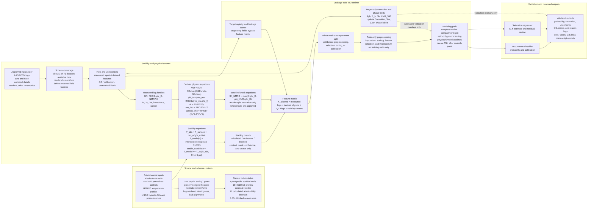

# Full Project ML Workflow Diagram

Created: 2026-06-15

## Purpose

This file records the source language for the new one-map workflow diagram
requested for the Word document and nine-slide deck refresh. The diagram should
replace the earlier idea of several separate workflow graphics as the main
project architecture visual.

The figure connects:

```text
public/source inputs
+ approved runtime inputs
+ stability-admissibility screen
+ well-log/core feature engineering
+ target registry and leakage barrier
+ occurrence classification
+ saturation regression
+ validation and public-safe exports
```

It is a workflow diagram only. It does not claim hydrate proof, final hydrate
stability, hydrate saturation, trained model performance, producibility, or
sweet-spot ranking.

## Current Generated Files

Main flowchart image:

```text
docs/project_blueprints/presentation_assets/full_workflow_diagram_2026_06_15/full_project_ml_workflow_flowchart.png
```

Expanded V3 split-node flowchart image for website review and mentor
discussion:

```text
docs/project_blueprints/presentation_assets/full_workflow_diagram_2026_06_15/full_project_ml_workflow_flowchart_expanded.png
```

Diagram-first PowerPoint draft:

```text
docs/project_blueprints/FULL_WORKFLOW_ML_DIAGRAM_9_SLIDE_North_Slope_Gas_Hydrate_Slides_2026-06-15.pptx
```

Word companion:

```text
docs/project_blueprints/North_Slope_Gas_Hydrate_Full_ML_Workflow_Diagram_2026-06-15.docx
```

Approved-data schema architecture plan and matrix:

```text
docs/APPROVED_DATA_SCHEMA_COVERAGE_AND_MODEL_ARCHITECTURE_PLAN.md
data/public_ml_products/approved_schema_coverage_matrix_2026-06-15.csv
```

Reproducible builder:

```text
docs/project_blueprints/build_full_workflow_diagram_deliverables.py
```

## Flowchart Source



## How To Explain The Diagram

The left side is now source and schema control rather than a public
communication box. It shows the public-source scaffold, the current status
counts, and the unit/depth/QC gates that decide whether a row is usable,
blocked, or still only context.

The center and right side are the OSL and approved-runtime build path. That is
where raw source rebuilds, approved LAS/CSV/core/NMR inputs, target mapping,
model training, validation, and runtime outputs belong.

The equation layer is explicit: hydrostatic absolute pressure, G10015
temperature interpolation/extrapolation, methane 5 ppt phase-boundary lookup,
lithology/reservoir equations, density porosity, velocity conversion,
acoustic impedance, lambda-rho, mu-rho, NMR-density separation, and any
Archie-style saturation baseline are feature or check producers. They do not
create proof by themselves.

The current V3 static export splits the workflow into many small boxes rather
than a few dense boxes. It uses five lanes: sources/schema, stability context,
feature engineering, leakage-safe ML, and validation/exports. Solid arrows show
allowed source, context, feature, and model flow. Dashed red arrows show
target-only labels and validation overlays that bypass the predictor matrix.

The stability branch feeds the ML workflow as context, a mask, a confidence
label, or a reason flag. It is not a hydrate occurrence label and not a
saturation estimate.

The leakage barrier keeps answer-like fields outside the predictor table.
`S_h`, `Sgh`, `NMR_SAT`, phase labels, interpreted saturation, and final ranks
are targets, calibration references, validation overlays, or outputs unless
proven to be independent measured inputs.

The approved-data schema coverage step is a methodology contribution outside
the stability screen. It uses the currently visible subset, about 3 of the
expected 71 datasets, plus header screenshots to decide the pipeline structure:
preserve original headers, assign roles, normalize units, keep QC/alignment
fields separate, and route target-only fields around the feature matrix.

The final ML workflow should show two linked outputs:

```text
occurrence classification + saturation regression
```

These outputs should be validated by complete wells or compartments, not
presented from random depth-row splits as final evidence.

## Current Status Labels Used

| Label | Meaning in the diagram |
|---|---|
| Complete | Public/OSL boundary, cited methane 5 ppt phase curve, hydrostatic pressure model, temperature-model logic, source-control labels, and guarded writer. |
| Calculated | Temperature key-depth rows and baseline methane 5 ppt stability-admissibility intervals. |
| Blocked | Missing source/control coverage, approved logs/core/NMR, target labels, trained model metrics, hydrate proof, saturation outputs, and sweet-spot ranking. |

Blocked means the workflow is refusing to overclaim without required inputs. It
does not mean no hydrate.

## Slide Use

Use the new generated deck as the diagram-first replacement draft. Slides 1 and
2 are preserved from the current Gmail authority deck. Slide 3 is the full
workflow map. Slides 4 through 8 are zoom-ins for the same map, and slide 9
summarizes what is complete, calculated, blocked, and pending mentor decision.

## Word Use

Use the Word companion as a short insert or appendix page. The main Word
document can introduce the diagram before the methodology section, then use it
to explain why stability, reservoir quality, hydrate response, target mapping,
modeling, and validation are separate steps.
