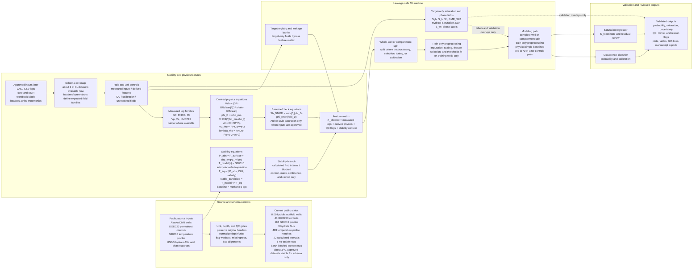

# Full Project ML Workflow Diagram

Created: 2026-06-15

## Purpose

This file records the source language for the V5.2 workflow-diagram package used
for the Word document and nine-slide mentor deck. The package has three levels:
a readable slide-sized overview, a detailed expanded poster, and a focused ML
runtime detail.

The figure connects:

```text
public/source inputs
+ approved runtime inputs
+ stability-admissibility screen
+ well-log/core feature engineering
+ target registry and leakage barrier
+ occurrence classification
+ saturation regression
+ validation and public-safe exports
```

It is a workflow diagram only. It does not claim hydrate proof, final hydrate
stability, hydrate saturation, trained model performance, producibility, or
sweet-spot ranking.

## Current Generated Files

Slide-sized workflow summary image:

```text
docs/project_blueprints/presentation_assets/full_workflow_diagram_2026_06_15/full_project_ml_workflow_flowchart.png
```

Expanded V5.2 visual architecture poster image for website review and mentor
discussion:

```text
docs/project_blueprints/presentation_assets/full_workflow_diagram_2026_06_15/full_project_ml_workflow_flowchart_expanded.png
```

ML architecture detail image:

```text
docs/project_blueprints/presentation_assets/full_workflow_diagram_2026_06_15/ml_pipeline_network_detail_v5.png
```

V5.2 PowerPoint package:

```text
docs/project_blueprints/V5_2_FULL_WORKFLOW_ML_DIAGRAM_North_Slope_Gas_Hydrate_Slides_2026-06-15.pptx
```

Word companion:

```text
docs/project_blueprints/V5_2_North_Slope_Gas_Hydrate_Full_ML_Workflow_Companion_2026-06-15.docx
```

Revised Drive review copies:

```text
REVISED V5 FULL WORKFLOW ML DIAGRAM 9-SLIDE North Slope Gas Hydrate Slides 2026-06-15
https://docs.google.com/presentation/d/1VjVXmaIckAIl6JptU06NYM8Y7qgfGMF-Xupbd1JkwK0

REVISED V5 North Slope Gas Hydrate Full ML Workflow Diagram 2026-06-15
https://docs.google.com/document/d/1w--XY9SobY-kadNby8ABBu-odXVveSm6l9wi_hdcSsw
```

V5 completion Drive copies:

```text
V5 COMPLETION Full Workflow ML Diagram 9-Slide North Slope Gas Hydrate Slides 2026-06-15
https://docs.google.com/presentation/d/1Tz_jpQByug6-RhsDwEKsA3AyPHMZdn8d6vnSS1Ndor0

V5 COMPLETION North Slope Gas Hydrate Full ML Workflow Diagram 2026-06-15
https://docs.google.com/document/d/17vxNmye93_W0_VEszEwMWCd7oDuCNLJxmADn9pzw6_Y
```

V5.2 Drive copies:

```text
V5.2 FULL WORKFLOW ML DIAGRAM North Slope Gas Hydrate Slides 2026-06-15
https://docs.google.com/presentation/d/1w9eqANgOc89c1wCUC0xi9eZoBup-3JNllSUI923skgA

V5.2 North Slope Gas Hydrate Full ML Workflow Companion 2026-06-15
https://docs.google.com/document/d/1dWBNYmwGerBV8steCo0v37PbhpIAZzqNQ-Psl78Ypa8
```

Mentor status package around the V5 workflow:

```text
docs/MENTOR_PROJECT_STATUS_PACKAGE_V5_WORKFLOW_2026-06-15.md
docs/project_blueprints/North_Slope_Gas_Hydrate_Mentor_Status_Package_V5_Workflow_2026-06-15.docx
```

Approved-data schema architecture plan and matrix:

```text
docs/APPROVED_DATA_SCHEMA_COVERAGE_AND_MODEL_ARCHITECTURE_PLAN.md
data/public_ml_products/approved_schema_coverage_matrix_2026-06-15.csv
data/public_ml_products/approved_data_field_role_table_2026-06-15.csv
docs/APPROVED_DATA_INTAKE_SPEC_2026-06-15.md
docs/FIRST_MODEL_EXPERIMENT_PLAN_2026-06-15.md
docs/MENTOR_DECISION_REQUESTS_2026-06-15.md
```

Reproducible builder:

```text
docs/project_blueprints/build_full_workflow_diagram_deliverables.py
```

## Flowchart Source



## Current ML Architecture Decisions And Open Mentor Questions

### A. Ready to encode now

- Keep slide 3 as the readable V5.2 overview. V5.2 implementation details
  belong in slide zoom-ins, the expanded poster, the Word companion, the
  website readiness panel, and the intake-validator docs.
- Train two linked outputs in the approved runtime: occurrence classification
  and saturation regression. Stability remains context/admissibility only and
  does not create either label.
- Numeric predictors should get train-only 0-1 scaling after the split. Depth
  remains the alignment/context axis unless mentor approves depth as an input
  predictor. Units must remain visible beside original headers.
- The variable fingerprint contract is now part of the runtime handoff:
  original header, unit, normalized name, role, allowed-in-feature-matrix flag,
  leakage risk, and unresolved mentor question.
- Feature entry requires source, unit, QC, and leakage checks for measured
  logs and derived features such as `GR` shale/clean-sand proxy, density
  porosity, resistivity transforms, `Vp`, `Vs`, `Vp/Vs`, impedance, elastic
  attributes, NMR-density separation, and equation-list features.
- Caliper coverage comes first. If `caliper`, `CAL1`, or differential caliper
  coverage is insufficient, use a missing-QC flag instead of applying a washout
  filter.
- Baselines come before tree/boosting models, and ANN/Keras comes after those
  controls. Chong et al. 2024 / USGS supports ANN hydrate occurrence classes
  and saturation prediction as an external ML pattern, not as North Slope model
  performance: <https://pubs.usgs.gov/publication/70250169>.
- Well-MTE is the Mt. Elbert Stratigraphic Test Well and Well-IGS is the Ignik
  Sikumi Test Well; both are Eileen Gas Hydrate Trend case-study wells. Keep
  `MTE_refined` and `IGS_refined` as blue workbook-stage questions until
  metadata confirms them: <https://www.osti.gov/servlets/purl/1893637>.
- Missing-log adapters for `Vp` or `RHOB` are optional and validation-required.
  Naim et al. 2023 / MDPI supports the idea in marine hydrate settings, but it
  does not automatically validate North Slope permafrost use:
  <https://www.mdpi.com/1996-1073/16/23/7709>.

### B. Blue mentor questions

- Which saturation field is authoritative: `Sgh`, `S_h`, `Sh`, or `NMR_SAT`?
- Should occurrence use source-style classes, saturation thresholds, or
  mentor-reviewed intervals?
- Are `MTE`/`IGS` separate wells and are `*_refined` processing stages in the
  workbook?
- Do we have enough caliper coverage to apply washout filtering?
- Which wells become blind validation after full recovery?
- Are missing-log adapters allowed, or should missing curves simply block that
  feature set?

## How To Explain The Diagram

The left side is now source and schema control rather than a public
communication box. It shows the public-source scaffold, the current status
counts, and the unit/depth/QC gates that decide whether a row is usable,
blocked, or still only context.

The center and right side are the OSL and approved-runtime build path. That is
where raw source rebuilds, approved LAS/CSV/core/NMR inputs, target mapping,
model training, validation, and runtime outputs belong.

The equation layer is explicit: hydrostatic absolute pressure, G10015
temperature interpolation/extrapolation, methane 5 ppt phase-boundary lookup,
lithology/reservoir equations, density porosity, velocity conversion,
acoustic impedance, lambda-rho, mu-rho, NMR-density separation, and any
Archie-style saturation baseline are feature or check producers. They do not
create proof by themselves.

The current V5.2 slide export is a mentor-scale workflow summary. It keeps the
same workflow logic but uses five readable cards: source/schema controls, stability
context, feature engineering, leakage-safe ML, and reviewed outputs. The data
boundary band distinguishes public GitHub/Streamlit communication from OSL or
approved-runtime execution, and the red target-only rail shows that Sgh, Sh,
NMR SAT, and phase labels are Y-side labels rather than predictors.

The expanded V5.2 poster is the detailed reference. It carries the public counts,
approved-OSL boundary, stability equations and caveats, measured/derived/QC and
context feature families, target-only occurrence and saturation labels, split
and train-only preprocessing controls, baseline-before-ML logic, validation
expectations, runtime/public output rules, and mentor decisions. Use it when the
reader needs the full architecture. It is now embedded in slide 4 of the V5.2
deck and supported by readable zoom slides.

The companion ML architecture visual expands the modeling lane into feature/QC
groups, the X allowed matrix, whole-well split and train-only preprocessing
controls, a simplified candidate model, occurrence and saturation output heads,
validation, reviewed outputs, and the red target-only rail. It is still an
architecture guide only, not a trained model or result claim.

The stability branch feeds the ML workflow as context, a mask, a confidence
label, or a reason flag. It is not a hydrate occurrence label and not a
saturation estimate.

The leakage barrier keeps answer-like fields outside the predictor table.
`S_h`, `Sgh`, `NMR_SAT`, phase labels, interpreted saturation, and final ranks
are targets, calibration references, validation overlays, or outputs unless
proven to be independent measured inputs.

The approved-data schema coverage step is a methodology contribution outside
the stability screen. It uses the currently visible subset, about 3 of the
expected 71 datasets, plus header screenshots to decide the pipeline structure:
preserve original headers, assign roles, normalize units, keep QC/alignment
fields separate, and route target-only fields around the feature matrix.

The final ML workflow should show two linked outputs:

```text
occurrence classification + saturation regression
```

These outputs should be validated by complete wells or compartments, not
presented from random depth-row splits as final evidence.

## Current Status Labels Used

| Label | Meaning in the diagram |
|---|---|
| Complete | Public/OSL boundary, cited methane 5 ppt phase curve, hydrostatic pressure model, temperature-model logic, source-control labels, schema/target guardrails, and guarded writer. |
| Calculated | 8,084 public scaffold wells, 43 GGD223 controls, 184 G10015 profiles, 3 hydrate AUs, 483 temperature-profile matches, 22 baseline methane 5 ppt admissibility intervals, and 8 no-stable rows. |
| Blocked | 8,054 stability-screen rows plus approved logs/core/NMR, official occurrence/saturation target authority, trained model metrics, hydrate proof, saturation outputs, and sweet-spot ranking. |

Blocked means the workflow is refusing to overclaim without required inputs. It
does not mean no hydrate.

## Slide Use

Use the generated deck as the active V5.2 workflow package for mentor review.
Slide 1 is now project-specific rather than a personal/about-me cover. Slide 2
keeps the methane hydrate intro in the Gmail visual format. Slide 3 is the
readable workflow summary. Slide 4 embeds the expanded architecture map. Slide
5 explains stability as context only. Slide 6 shows the variable fingerprint,
depth, normalization, caliper, X-allowed, and Y-only rules. Slide 7 embeds the
ML runtime/network detail. Slide 8 gives the occurrence/saturation, split,
missing-log, and model-order decision boxes. Slide 9 summarizes what is
complete, calculated, blocked, and pending mentor decision.

## Word Use

Use the Word companion as a short insert or appendix page. The main Word
document can introduce the diagram before the methodology section, then use it
to explain why stability, reservoir quality, hydrate response, target mapping,
modeling, and validation are separate steps.

For mentor check-ins, use the separate status package to keep the message short:
where the project is now, what has been completed outside the stability screen,
what remains blocked by approved data or label authority, and what decisions
are needed before final ML claims can be made.

## Mentor Decisions

The V5.2 package should keep these questions visible:

1. Phase-curve policy: keep methane 5 ppt as the only official baseline, or add
   a labeled scenario table?
2. Target authority: which saturation and occurrence labels are official for
   training and validation?
3. Validation split: use whole-well, compartment, geographic holdout, or a
   staged combination?
4. Temperature handling: when G10015 is missing, keep rows blocked, use proxy
   tiers, or run scenario-only gradients?
5. ML use of stability: allow the stability screen as context, confidence,
   reason flag, or mask only, never as an occurrence label?
6. Public website outputs: which diagrams, counts, schema, caveat views, and
   readiness views are acceptable before approved model validation?
