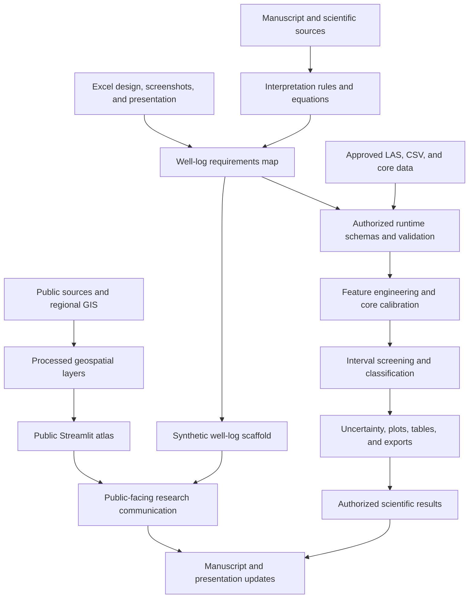

# Project Architecture and Activity Map

Last updated: 2026-06-08

## Purpose

This document answers four questions:

1. What are we building?
2. How do the project components connect?
3. Where are we now?
4. What must happen next?

Update this document after a meaningful milestone, decision, blocker, or change
in priority. Do not record every small edit.

## Target Outcome

Create a scientifically defensible North Slope gas-hydrate research system with:

- a public regional GIS and research website;
- a synthetic well-log demonstration;
- an authorized runtime for real well-log and core inputs;
- reproducible classification, uncertainty, plots, and exports;
- aligned manuscript and presentation deliverables.

## System Architecture

## Data Boundary

### Public Repository

- public GIS inputs and derived regional layers;
- notebooks and reusable code;
- synthetic well-log examples;
- public-source manuscript drafts;
- public website assets and documentation;
- schemas, validation logic, and empty runtime adapters.

### Authorized Runtime Only

- approved or restricted LAS/CSV/core files;
- named restricted well identifiers;
- derived sensitive results;
- populated local configurations;
- fitted models and runtime logs.

The public website must never load authorized runtime data.

## Component Map

| Component | Main location | Current state | Next outcome |
|---|---|---|---|
| Public atlas | `dashboard/app.py` | Implemented | Continue visual QA as features change |
| Website entry point | `streamlit_app.py` | Public deployment verified | Keep the hosted app synchronized with `main` |
| Synthetic well-log engine | `dashboard/well_log_engine.py` | Working scaffold | Align with Excel design |
| Authorized runtime | `dashboard/runtime/` | Skeleton implemented | Complete input mapping and readiness UI |
| Well-log tests | `tests/` | 8 focused tests passing | Expand with spreadsheet-derived cases |
| GIS pipeline | notebooks and `03_data_final/` | Recovered | Validate only when GIS changes are needed |
| Manuscript | `docs/project_blueprints/` | Two drafts recovered | Reconcile with equations and final workflow |
| Presentation | Not yet recovered | Blocked | Recover from the source laptop |
| Excel design | Not yet recovered | Blocked | Recover workbook and screenshots |
| Source library | Index recovered; full library incomplete | Partial | Recover and inventory public sources |
| Git history | Connected and synchronized with GitHub | Complete | Preserve the normal commit-and-push workflow |

## Workstream Activity Map

| ID | Workstream | Status | Immediate activity | Dependency | Completion signal |
|---|---|---|---|---|---|
| W1 | Recover project artifacts | In progress | Collect PowerPoint, Excel workbook, screenshots, manuscript variants, and source files from the source laptop | Access to other laptop | Recovery inventory is complete |
| W2 | Organize source intake | Waiting | Classify recovered files as public, synthetic, or restricted and place them appropriately | W1 | Every recovered file has a location and classification |
| W3 | Extract Excel requirements | Waiting | Document sheets, columns, units, formulas, chart tracks, flags, and expected outputs | W1, W2 | Approved requirements map exists |
| W4 | Gap analysis | Waiting | Compare spreadsheet requirements with the current engine and runtime package | W3 | Missing and existing capabilities are listed |
| W5 | Implement well-log scaffold | Waiting | Add required schemas, calculations, validation, plots, and exports | W4 | Requirements are implemented with tests |
| W6 | Website integration and QA | Partial | Public sharing and phone-width roadmap cards are complete; well-log workflow QA remains | W5 for final workflow | Website behavior and labels are verified |
| W7 | Scientific alignment | Partial | Reconcile equations and interpretation rules across code, manuscript, and presentation | W1, W3, W5 | No material scientific contradictions remain |
| W8 | Git and project stabilization | Complete | Keep local `main` synchronized with `origin/main` and preserve focused commits | None | Clean history, remote, and documented workflow |
| W9 | Authorized-data execution | Future | Configure approved runtime and run real-data validation only in the authorized environment | W5, authorization | Reproducible authorized outputs exist |

Status vocabulary: `Ready`, `In progress`, `Waiting`, `Blocked`, `Partial`,
`Complete`, or `Future`.

## Current Priority

### Priority 1: Recover Inputs

On the source laptop, gather:

- `Alaska_North_Slope_Wireline_ML_Presentation_Scaffold_outline.pptx`;
- the Excel workbook and spreadsheet screenshots;
- manuscript and equation-map documents;
- the public source library and its inventory.

Create one recovery folder, preserving original filenames and folder structure.
Do not mix restricted data into the public recovery package.

### Priority 2: Build the Requirements Map

After recovery, create `docs/WELL_LOG_REQUIREMENTS_MAP.md` containing:

- workbook sheet and screenshot reference;
- source variable and unit;
- formula or interpretation rule;
- required input and validation;
- target runtime module;
- target website display;
- expected export;
- test case and acceptance criterion.

### Priority 3: Implement and Verify

Use the requirements map to make focused code changes, add tests, and visually
inspect the Streamlit workflow.

## Blockers and Risks

| Item | Impact | Resolution |
|---|---|---|
| PowerPoint and Excel files are not in this folder | Requirements cannot be finalized | Recover from the source laptop |
| Connected Drive may be the wrong Google account | Some uploaded sources may remain hidden | Check the account used on the other laptop |
| June 6 migration was a failed local test | Source library was not actually uploaded | Repeat migration only after verifying real paths and destination |
| Public and restricted files could be mixed | Data-governance and publication risk | Classify every recovered item before copying |

## Near-Term Sequence

1. Recover the missing PowerPoint, Excel artifacts, and public sources.
2. Create a recovery inventory with data classification.
3. Build the well-log requirements map.
4. Perform the code-to-requirements gap analysis.
5. Implement the missing scaffold behavior and tests.
6. Run website visual QA.
7. Align the manuscript and PowerPoint with the verified implementation.
8. Keep the architecture tracker, tests, commits, and hosted deployment synchronized.

## Key Decisions

- The repository root is the official working folder.
- `PROJECT_CONTEXT.md` holds concise project orientation.
- This document is the authoritative architecture, activity, and next-work map.
- The classification-methods draft is the primary scientific methods direction.
- The public website remains public-source and synthetic only.
- Real approved data remains in the authorized runtime environment.

## Important Activity Log

| Date | Activity | Result |
|---|---|---|
| 2026-06-07 | Recovered the working project from a prior Codex session | Website, notebooks, GIS layers, Word drafts, and runtime scaffold restored |
| 2026-06-07 | Verified focused well-log/runtime tests | 8 tests passed |
| 2026-06-07 | Investigated source migration and Google Drive | Confirmed the migration was a failed local test and identified the source-laptop paths |
| 2026-06-08 | Established architecture and activity tracking | This document became the authoritative next-work map |
| 2026-06-08 | Added roadmap to Streamlit and responsive mobile styling | Architecture status is available inside the website and narrow screens stack key layouts |
| 2026-06-08 | Identified the hosted Streamlit deployment | Saved the canonical URL and found that anonymous access is currently disabled |
| 2026-06-08 | Verified Git synchronization and improved the mobile roadmap | Local `main` matches `origin/main`; narrow screens receive workstream cards and a clearer next-project move |
| 2026-06-08 | Made the hosted Streamlit deployment public | Anonymous requests reach the app without a Streamlit access-denied response |
