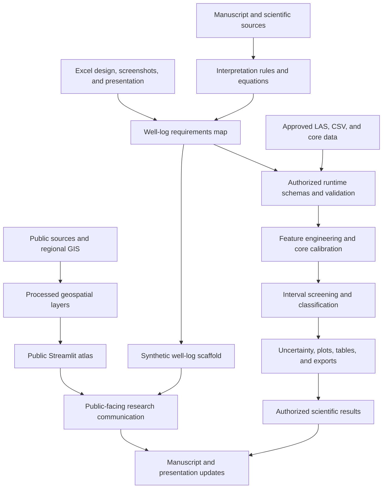

# Project Architecture and Activity Map

Last updated: 2026-06-10

## Purpose

This document answers four questions:

1. What are we building?
2. How do the project components connect?
3. Where are we now?
4. What must happen next?

Update this document after a meaningful milestone, decision, blocker, or change
in priority. Do not record every small edit.

## Target Outcome

Create a scientifically defensible North Slope gas-hydrate research system with:

- a public regional GIS and research website;
- a synthetic well-log demonstration;
- an authorized runtime for real well-log and core inputs;
- reproducible classification, uncertainty, plots, and exports;
- aligned manuscript and presentation deliverables.

## System Architecture

## Data Boundary

### Public Repository

- public GIS inputs and derived regional layers;
- notebooks and reusable code;
- synthetic well-log examples;
- public-source manuscript drafts;
- public website assets and documentation;
- schemas, validation logic, and empty runtime adapters.

### Authorized Runtime Only

- approved or restricted LAS/CSV/core files;
- named restricted well identifiers;
- derived sensitive results;
- populated local configurations;
- fitted models and runtime logs.

The public website must never load authorized runtime data.

## Component Map

| Component | Main location | Current state | Next outcome |
|---|---|---|---|
| Public atlas | `dashboard/app.py` | Four-page Processing-style visual redesign implemented with legacy route aliases | Polish visuals and keep public/synthetic data boundary verified during deployment |
| Website entry point | `streamlit_app.py` | Public deployment verified | Keep the hosted app synchronized with `main` |
| Synthetic well-log engine | `dashboard/well_log_engine.py` | Working scaffold | Align with Excel design |
| Authorized runtime | `dashboard/runtime/` | Source-driven readiness and grouped-well split scaffold implemented | Complete workbook-derived input mapping and model evaluation |
| Well-log tests | `tests/` | 19 project tests passing | Expand with workbook-derived unit, label, and alignment cases |
| GIS pipeline | notebooks and `03_data_final/` | Recovered | Validate only when GIS changes are needed |
| Manuscript | `docs/project_blueprints/` | Two drafts recovered; new crisp research-overview Word deliverable generated | Reconcile with equations and final workflow after approved labels are confirmed |
| Presentation | PowerPoint scaffold recovered from Gmail; new eight-slide research-overview deck generated | Partial | Align final deck with approved-data results and figures when available |
| Excel design | Header screenshots recovered; workbook missing | Partial | Confirm formulas, units, and mnemonics from the workbook |
| Source library | Index recovered; full library incomplete | Partial | Recover and inventory public sources |
| Git history | Connected and synchronized with GitHub | Complete | Preserve the normal commit-and-push workflow |

## Workstream Activity Map

| ID | Workstream | Status | Immediate activity | Dependency | Completion signal |
|---|---|---|---|---|---|
| W1 | Recover project artifacts | In progress | Collect the full Excel workbook, remaining manuscript variants, and source files; the header screenshots and PowerPoint are recovered | Access to other laptop | Recovery inventory is complete |
| W2 | Organize source intake | Waiting | Classify recovered files as public, synthetic, or restricted and place them appropriately | W1 | Every recovered file has a location and classification |
| W3 | Extract Excel requirements | In progress | Confirm the three-header-reference map against workbook formulas, units, tool mnemonics, and alignment logic; generated samples remain synthetic only | Full workbook recovery | Approved requirements map is complete |
| W4 | Gap analysis | Waiting | Compare spreadsheet requirements with the current engine and runtime package | W3 | Missing and existing capabilities are listed |
| W5 | Implement well-log scaffold | In progress | Runtime Readiness, source-derived QC, target contracts, and grouped-well split planning are implemented and exposed as the website `Log Scaffold` page; next add workbook-derived mapping and baseline evaluation | W3, W4 | Requirements are implemented with tests |
| W6 | Website integration and QA | In progress | Four-page navigation, legacy aliases, Processing-style public/synthetic visual sections, and consolidated Explore/Analyze/Project Plan pages are implemented; next polish the visual copy and deployment QA | W5 for final workflow | Hosted deployment shows the four-page visual workflow with responsive QA and no data-boundary regression |
| W7 | Scientific alignment | Partial | Reconcile equations and interpretation rules across code, manuscript, and presentation | W1, W3, W5 | No material scientific contradictions remain |
| W8 | Git and project stabilization | Complete | Keep local `main` synchronized with `origin/main` and preserve focused commits | None | Clean history, remote, and documented workflow |
| W9 | Authorized-data execution | Future | Configure approved runtime and run real-data validation only in the authorized environment | W5, authorization | Reproducible authorized outputs exist |
| W10 | Word and PowerPoint deliverables | In progress | Research-overview Word and nine-slide PowerPoint were revised from the user's emailed instructions, upgraded with project visual assets, and further strengthened with Chong et al. ANN architecture context, model-branch logic, leakage guardrails, and the current Streamlit 3D map link; next replace the about-me placeholder and later approved-data figures when available | W3, W5, W7 | Both deliverables use the verified workflow, figures, terminology, and validation plan |

Status vocabulary: `Ready`, `In progress`, `Waiting`, `Blocked`, `Partial`,
`Complete`, or `Future`.

## Current Priority

Improvement decisions should follow
`docs/PROJECT_IMPROVEMENT_STRATEGY.md`. The project will prioritize scientific
traceability and runtime readiness over adding disconnected pages or opaque
classification features.

### Priority 1: Confirm Inputs and Targets

On the source laptop, gather:

- the full Excel workbook and any additional header/formula references;
- manuscript and equation-map documents;
- the public source library and its inventory.

Create one recovery folder, preserving original filenames and folder structure.
Do not mix restricted data into the public recovery package.

### Priority 2: Build the Requirements Map

After recovery, create `docs/WELL_LOG_REQUIREMENTS_MAP.md` containing:

- workbook sheet and screenshot reference;
- source variable and unit;
- formula or interpretation rule;
- required input and validation;
- target runtime module;
- target website display;
- expected export;
- test case and acceptance criterion.

### Priority 3: Implement, Validate, and Build Deliverables

Use the requirements map to make focused code changes, add tests, and visually
inspect the Streamlit workflow. Build reusable figures for the Word document and
reduce the recovered PowerPoint scaffold toward the requested approximately
eight-slide visual presentation.

## Blockers and Risks

| Item | Impact | Resolution |
|---|---|---|
| Full Excel workbook is not in this folder | Requirements and labels cannot be finalized | Recover from the source laptop |
| Exact saturation and phase-label fields are not confirmed | Models cannot be trained defensibly until known-well targets are mapped | Confirm the authoritative saturation field, NMR-derived or otherwise supplied saturation targets, phase labels, and uncertain-label convention |
| Connected Drive may be the wrong Google account | Some uploaded sources may remain hidden | Check the account used on the other laptop |
| June 6 migration was a failed local test | Source library was not actually uploaded | Repeat migration only after verifying real paths and destination |
| Public and restricted files could be mixed | Data-governance and publication risk | Classify every recovered item before copying |

## Near-Term Sequence

1. Recover the missing Excel artifacts and remaining public sources.
2. Create a recovery inventory with data classification.
3. Confirm the exact saturation target, NMR target role, and phase labels; refine the approximately 14-known / 57-prediction well plan after inventory.
4. Build the well-log requirements map.
5. Perform the code-to-requirements gap analysis.
6. Extend the implemented Runtime Readiness and grouped-well split scaffolds with workbook-derived rules and baseline models.
7. Polish and deploy the implemented four-page Processing-style website redesign.
8. Apply the eight-slide specification, reuse website visuals, and align the Word document.
9. Run complete website visual QA.
10. Keep the architecture tracker, tests, commits, and hosted deployment synchronized.

## Key Decisions

- The repository root is the official working folder.
- `PROJECT_CONTEXT.md` holds concise project orientation.
- This document is the authoritative architecture, activity, and next-work map.
- The classification-methods draft is the primary scientific methods direction.
- The public website remains public-source and synthetic only.
- Real approved data remains in the authorized runtime environment.

## Important Activity Log

| Date | Activity | Result |
|---|---|---|
| 2026-06-07 | Recovered the working project from a prior Codex session | Website, notebooks, GIS layers, Word drafts, and runtime scaffold restored |
| 2026-06-07 | Verified focused well-log/runtime tests | 8 tests passed |
| 2026-06-07 | Investigated source migration and Google Drive | Confirmed the migration was a failed local test and identified the source-laptop paths |
| 2026-06-08 | Established architecture and activity tracking | This document became the authoritative next-work map |
| 2026-06-08 | Added roadmap to Streamlit and responsive mobile styling | Architecture status is available inside the website and narrow screens stack key layouts |
| 2026-06-08 | Identified the hosted Streamlit deployment | Saved the canonical URL and found that anonymous access is currently disabled |
| 2026-06-08 | Verified Git synchronization and improved the mobile roadmap | Local `main` matches `origin/main`; narrow screens receive workstream cards and a clearer next-project move |
| 2026-06-08 | Made the hosted Streamlit deployment public | Anonymous requests reach the app without a Streamlit access-denied response |
| 2026-06-08 | Defined the project improvement strategy | Established product pillars, a feature decision test, phased priorities, and ML guardrails |
| 2026-06-08 | Reviewed normalized Excel header screenshots | Kept the images out of Git and the website; retained only a public-safe header/schema requirements map |
| 2026-06-08 | Reviewed connected Drive research and strengthened the synthetic scaffold | Added a seven-domain explainable sweet-spot model and documented the boundary between scientific tendencies and synthetic thresholds |
| 2026-06-08 | Added the focused North Slope Sweet Spots page | Combined ranked synthetic intervals, input variables, geomechanics, uncertainty, competing explanations, and sources in one decision workspace |
| 2026-06-08 | Expanded and tiered sweet-spot source provenance | Distinguished ten primary public references from 28 indexed project artifacts and the four-document Drive synthesis subset |
| 2026-06-08 | Integrated project-direction emails and the attached ML paper | Added the vision/goals/next-steps tracker, clarified deliverable priority and validation requirements, and recovered the PowerPoint scaffold from Gmail |
| 2026-06-08 | Implemented source-driven runtime and deliverable changes | Added curve/output readiness, Chong feature contracts, caliper washout QC, grouped-well splits, target provenance, and an eight-slide deck specification |
| 2026-06-08 | Planned the website navigation and visual redesign | Defined a four-page information architecture, overview visual prompts, icon/color rules, staged change sets, and mobile acceptance criteria before implementation |
| 2026-06-08 | Confirmed the working ML cohort assumptions | Recorded approximately 71 wells, 20% known wells for development, 80% prediction wells, and separate classification and saturation outputs |
| 2026-06-09 | Updated NMR availability and regenerated deliverables | Recorded that NMR and all screenshot-listed fields are available; created a crisp research-overview Word document and eight-slide PowerPoint |
| 2026-06-09 | Revised deliverables from emailed instructions | Word now fills abstract/introduction and leaves later sections as outline placeholders with process sketches; PowerPoint now uses the requested nine-slide structure |
| 2026-06-09 | Embedded website visuals into the PowerPoint | Added generated 3D regional context, synthetic well-log panel, ML validation placeholder, and sweet-spot ranking images to the nine-slide deck |
| 2026-06-09 | Strengthened the ML architecture and map slides | Updated the live Google Slides deck and reproducible PPTX with Chong et al. ANN source-paper context, classification/regression branches, target-leakage guardrails, complete-well validation, and a refreshed Streamlit Structural Explorer 3D map image with a live-app link |
| 2026-06-09 | Re-exposed the website log scaffold | Added a first-class `Log Scaffold` navigation entry, kept the legacy `Future Well-Log Engine` query alias, and added a welcome-page link so the synthetic well-log/runtime scaffold is visible again |
| 2026-06-10 | Audited the website for a Processing-style visual redesign | Added `docs/WEBSITE_PROCESSING_VISUAL_AUDIT.md` with a page-by-page current-format to target-format map before implementation changes |
| 2026-06-10 | Implemented the Processing-style website redesign | Reduced the Streamlit site to Overview, Explore North Slope, Analyze Hydrates, and Project Plan; added public/synthetic canvas sketches, consolidated old pages into three-tab workflows, preserved legacy route aliases, and verified desktop/mobile rendering |
| 2026-06-10 | Clarified header-derived synthetic data provenance | Recorded that only three Excel header references are available and that website/test sample rows are generated synthetic records, not user-supplied well-log data |
| 2026-06-10 | Rebuilt Word and PowerPoint deliverables after website redesign | Regenerated the research-overview DOCX/PPTX with header-derived synthetic-data provenance, source anchors, the subsurface evidence stack, and the four-page Streamlit workflow |
