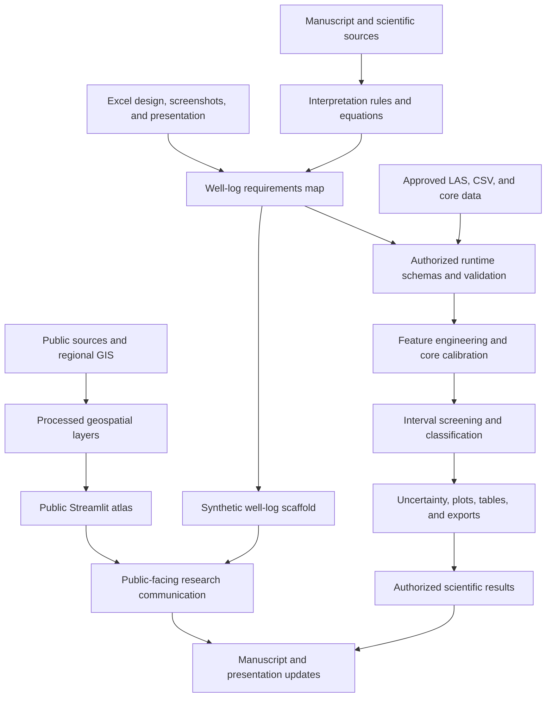

# Project Architecture and Activity Map

Last updated: 2026-06-15

## Purpose

This document answers four questions:

1. What are we building?
2. How do the project components connect?
3. Where are we now?
4. What must happen next?

Update this document after a meaningful milestone, decision, blocker, or change
in priority. Do not record every small edit.

## Target Outcome

Create a scientifically defensible North Slope gas-hydrate research system with:

- a public regional GIS and research website; this webiste needs to be private if we are gonna put classified data on it. the main goal is the slides and document the website is kinda of anothe rmiddle man to store skelton structurs that i can bring into the doe virtual desktop into anaconda to like put the datasets in and then run thhe system. i can run jupyter notebook on anaconda so geting thhe vs code stuff is fine probably. i also have access to antigravity its like a agentic ai helper.
- a synthetic well-log demonstration; that is more the end product of our logical reasoning to each paramters ranges and changes that describe gas hydrates. thhat was the visual i dea i came up with for one of the slides to describe how hydrates are being identified in the nort slpe of alska does that make snese?
- an authorized runtime for real well-log and core inputs; im not sure what means like run time whhat do you mean?
- reproducible classification, uncertainty, plots, and exports;  yes! thats whhat the website is for to put a bunch of skeletons in there.
- aligned manuscript and presentation deliverables. for sure

## System Architecture

```mermaid
flowchart TD
    A["Public sources and regional GIS"] --> B["Processed geospatial layers"]
    B --> C["Public Streamlit atlas"]
    D["Manuscript and scientific sources"] --> E["Interpretation rules and equations"]
    F["Excel design, screenshots, and presentation"] --> G["Well-log requirements map"]
    E --> G
    G --> H["Synthetic well-log scaffold"]
    G --> I["Authorized runtime schemas and validation"]
    J["Approved LAS, CSV, and core data"] --> I
    I --> K["Feature engineering and core calibration"]
    K --> L["Interval screening and classification"]
    L --> M["Uncertainty, plots, tables, and exports"]
    C --> N["Public-facing research communication"]
    H --> N
    M --> O["Authorized scientific results"]
    N --> P["Manuscript and presentation updates"]
    O --> P
```

## Data Boundary

### Public Repository

- public GIS inputs and derived regional layers;
- notebooks and reusable code;
- synthetic well-log examples;
- public-source manuscript drafts;
- public website assets and documentation;
- schemas, validation logic, and empty runtime adapters.

### Authorized Runtime Only

- approved or restricted LAS/CSV/core files;
- named restricted well identifiers;
- derived sensitive results;
- populated local configurations;
- fitted models and runtime logs.

The public website must never load authorized runtime data.

## Component Map

| Component | Main location | Current state | Next outcome |
|---|---|---|---|
| Public atlas | `dashboard/app.py` | Four-page Processing-style visual redesign implemented with legacy route aliases; Analyze Hydrates includes an ML visual architecture section | Polish visuals and keep public/synthetic data boundary verified during deployment |
| Website entry point | `streamlit_app.py` | Public deployment verified | Keep the hosted app synchronized with `main` |
| Synthetic well-log engine | `dashboard/well_log_engine.py` | Working scaffold | Align with Excel design |
| Authorized runtime | `dashboard/runtime/` | Source-driven readiness and grouped-well split scaffold implemented | Complete workbook-derived input mapping and model evaluation |
| Well-log tests | `tests/` | 23 project tests passing | Expand with workbook-derived unit, label, and alignment cases |
| GIS pipeline | notebooks and `03_data_final/` | Recovered | Validate only when GIS changes are needed |
| Manuscript | `docs/project_blueprints/` | Two drafts recovered; the local research-overview Word deliverable was rebuilt on 2026-06-13 from the science-to-ML ladder, baseline source ledger, source-backed parameter movements, screening-envelope language, target leakage rules, model ladder, and validation plan | Review the rebuilt local DOCX, then calibrate claims against workbook formulas, approved labels, and recoverable range provenance before any results-bearing revision |
| Presentation | Current Drive baseline is the public-safe 2026-06-13 science-to-ML 9-slide raster-panel revision; a separate local 2026-06-15 stability/ML remake draft now exists at `docs/project_blueprints/STABILITY_ML_REMAKE_9_SLIDE_North_Slope_Gas_Hydrate_Slides_2026-06-15.pptx`, preserving Gmail authority slides 1-2 and regenerating slides 3-9 from `docs/project_blueprints/build_stability_ml_slide_remake.py` | In progress | Review the local stability/ML remake, decide whether to replace or adapt the Drive deck, then keep Word and slides synchronized without adding unsupported results claims |
| Mentor and deliverable communication | `docs/MENTOR_STATUS_UPDATE_DRAFT.md`, `docs/WEEKDAY_PROGRESS_REPORT_TEMPLATE.md`, `docs/DELIVERABLE_REFRESH_PLAN_STABILITY_AND_ML.md`, `docs/SLIDE_REMAKE_STORYBOARD_STABILITY_AND_ML.md` | Drafted public-safe stability-screen status language, mentor questions, weekday reporting template, Word/PPT refresh diagrams, and a slide-by-slide visual remake storyboard | Review with mentor, then feed approved language and storyboard into the Word and slide builders |
| Excel design | Header screenshots recovered; workbook missing | Partial | Confirm formulas, units, and mnemonics from the workbook |
| Source library | Index recovered; 2026-06-13 stability source bundle documented, uploaded locally in OpenScienceLab, connected to a Structural Explorer source panel, paired with a committed public snapshot fallback, extended with public Arctic Slope well-context, G10015 temperature-inventory, and stability input scaffold products; the hydrate ML/physics intake also records downloaded OSTI PDFs, official source-page backups, Google Drive PDF references, and a needs-PDF manifest | In progress | Use OpenScienceLab as the heavy-data workbench, commit only derived public-safe stability products, digitize/georeference OM-222 if no ready GIS derivative is found, and continue recovering institution-accessible/public sources |
| Git history | Connected and synchronized with GitHub | Complete | Preserve the normal commit-and-push workflow |

## Workstream Activity Map

| ID | Workstream | Status | Immediate activity | Dependency | Completion signal |
|---|---|---|---|---|---|
| W1 | Recover project artifacts | In progress | Collect the full Excel workbook, remaining manuscript variants, and source files; the header screenshots and PowerPoint are recovered | Access to other laptop | Recovery inventory is complete |
| W2 | Organize source intake | In progress | The public stability source bundle is documented and uploaded locally under `data/source_library/`; committed outputs under `data/public_stability_snapshot/` and `data/public_stability_products/` keep the website usable while raw bundles stay out of Git | W1 | Every recovered file has a location and classification |
| W3 | Extract Excel requirements | In progress | Confirm the three-header-reference map against workbook formulas, units, tool mnemonics, and alignment logic; generated samples remain synthetic only | Full workbook recovery | Approved requirements map is complete |
| W4 | Gap analysis | Waiting | Compare spreadsheet requirements with the current engine and runtime package | W3 | Missing and existing capabilities are listed |
| W5 | Implement well-log scaffold | In progress | Runtime Readiness, source-derived QC, target contracts, and grouped-well split planning are implemented and exposed as the website `Log Scaffold` page; next add workbook-derived mapping and baseline evaluation | W3, W4 | Requirements are implemented with tests |
| W6 | Website integration and QA | In progress | Four-page navigation, legacy aliases, Processing-style public/synthetic visual sections, consolidated Explore/Analyze/Project Plan pages, ML architecture sketches, stability snapshot fallback, public well stability-context metrics, G10015 temperature-inventory metrics, stability input scaffold, and stability pipeline readiness are implemented; website work is limited to public delivery products from the OSL workbench | W5 for final workflow | Hosted deployment shows the four-page visual workflow with responsive QA and no data-boundary regression |
| W7 | Scientific alignment | Partial | Use `docs/SCIENCE_TO_ML_LOGIC_LADDER.md`, `docs/ML_PIPELINE_BASELINE_SOURCE_LEDGER.md`, and the stability calculation docs to reconcile hydrate habits, parameter tiers, parameter movement patterns, screening-envelope ranges, equations, guardrails, model options, and interpretation rules across code, manuscript, and presentation | W1, W3, W5 | No material scientific contradictions remain |
| W8 | Git and project stabilization | Complete | Keep local `main` synchronized with `origin/main` and preserve focused commits | None | Clean history, remote, and documented workflow |
| W9 | Authorized-data execution | Future | Configure approved runtime and run real-data validation only in the authorized environment | W5, authorization | Reproducible authorized outputs exist |
| W10 | Word and PowerPoint deliverables | In progress | Review the 2026-06-15 local stability/ML remake beside the 2026-06-13 native Google Docs/Slides imports, then decide what becomes the next official Word/PPT refresh | W3, W5, W7 | Both deliverables use the verified workflow, figures, terminology, parameter tiers, screening-envelope language, guarded model options, validation plan, and no unsupported results claims |
| W11 | Stability-screen communication | In progress | Use the mentor update, weekday template, deliverable refresh plan, and generated local slide-remake draft to describe OpenScienceLab as the heavy-data workbench, GitHub/Streamlit as the public delivery surface, and the current stability workflow as an admissibility screen only | W7, W9, W10 | Mentor-facing language and refresh diagrams are approved without claiming hydrate proof, saturation, or sweet-spot ranking |

Status vocabulary: `Ready`, `In progress`, `Waiting`, `Blocked`, `Partial`,
`Complete`, or `Future`.

## Current Priority

Improvement decisions should follow
`docs/PROJECT_IMPROVEMENT_STRATEGY.md`. For the next Word, PowerPoint, or
website edit, review `docs/PROJECT_DIRECTION_LOCK_FOR_REVIEW.md` and
`docs/SCIENCE_TO_ML_LOGIC_LADDER.md`, then use
`docs/ML_PIPELINE_BASELINE_SOURCE_LEDGER.md` so the goal, audience,
deliverable order, science-to-ML narrative, parameter tiers, source-backed
pipeline choices, model guardrails, and public-data boundary stay explicit. The
2026-06-13 Word/PPT rebuild is now the working deliverable base and has been
imported to Google Drive as native Docs/Slides files for review. For the
stability-screen communication pass, use
`docs/MENTOR_STATUS_UPDATE_DRAFT.md`,
`docs/WEEKDAY_PROGRESS_REPORT_TEMPLATE.md`, and
`docs/DELIVERABLE_REFRESH_PLAN_STABILITY_AND_ML.md` to keep the mentor update,
weekday reporting, and planned Word/PPT refresh aligned. Use
`docs/SLIDE_REMAKE_STORYBOARD_STABILITY_AND_ML.md` and the local
`docs/project_blueprints/STABILITY_ML_REMAKE_9_SLIDE_North_Slope_Gas_Hydrate_Slides_2026-06-15.pptx`
draft for the next slide-review pass before any Drive replacement. The project will
prioritize scientific traceability and runtime readiness over adding
disconnected pages or opaque classification features.

### Priority 1: Confirm Inputs and Targets

On the source laptop, gather:

- the full Excel workbook and any additional header/formula references;
- manuscript and equation-map documents;
- the public source library and its inventory.

Create one recovery folder, preserving original filenames and folder structure.
Do not mix restricted data into the public recovery package.

### Priority 2: Build the Requirements Map

After recovery, create `docs/WELL_LOG_REQUIREMENTS_MAP.md` containing:

- workbook sheet and screenshot reference;
- source variable and unit;
- formula or interpretation rule;
- required input and validation;
- target runtime module;
- target website display;
- expected export;
- test case and acceptance criterion.

### Priority 3: Implement, Validate, and Build Deliverables

Use the requirements map to make focused code changes, add tests, and visually
inspect the Streamlit workflow. Keep the Word document and the corrected
9-slide PowerPoint deck synchronized as workbook formulas, target provenance,
and approved-data figures become available.

## Blockers and Risks

| Item | Impact | Resolution |
|---|---|---|
| Full Excel workbook is not in this folder | Requirements and labels cannot be finalized | Recover from the source laptop |
| Exact saturation and phase-label fields are not confirmed | Models cannot be trained defensibly until known-well targets are mapped | Confirm the authoritative saturation field, NMR-derived or otherwise supplied saturation targets, phase labels, and uncertain-label convention |
| Connected Drive may be the wrong Google account | Some uploaded sources may remain hidden | Check the account used on the other laptop |
| June 6 migration was a failed local test | Source library was not actually uploaded | Repeat migration only after verifying real paths and destination |
| Public and restricted files could be mixed | Data-governance and publication risk | Classify every recovered item before copying |

## Near-Term Sequence

1. Recover the missing Excel artifacts and remaining public sources.
2. Create a recovery inventory with data classification.
3. Confirm the exact saturation target, NMR target role, and phase labels; refine the approximately 14-known / 57-prediction well plan after inventory.
4. Build the well-log requirements map.
5. Perform the code-to-requirements gap analysis.
6. Extend the implemented Runtime Readiness and grouped-well split scaffolds with workbook-derived rules and baseline models.
7. Review the stability-screen communication drafts and reconcile open count,
   phase-curve, confidence-threshold, and approved-validation-field decisions.
8. Review the 2026-06-15 local stability/ML slide remake and the 2026-06-13
   local Word/PPT rebuild against
   `docs/PROJECT_DIRECTION_LOCK_FOR_REVIEW.md`,
   `docs/SCIENCE_TO_ML_LOGIC_LADDER.md`,
   `docs/ML_PIPELINE_BASELINE_SOURCE_LEDGER.md`,
   `docs/ML_CITATION_PACKET_FOR_DELIVERABLES.md`, and
   `docs/deliverable_revision_base_2026_06_12/`, so source claims,
   hydrate-system framing, parameter tiers, baseline pipeline choices, ML
   explanation, format rules, and visual language stay synchronized.
9. Keep the Word and PowerPoint deliverables synchronized as workbook formulas,
   approved labels, and final figures become available.
10. Polish and deploy the implemented four-page Processing-style website redesign.
11. Run complete website visual QA.
12. Keep the architecture tracker, tests, commits, and hosted deployment synchronized.

## Key Decisions

- The repository root is the official working folder.
- `PROJECT_CONTEXT.md` holds concise project orientation.
- This document is the authoritative architecture, activity, and next-work map.
- The classification-methods draft is the primary scientific methods direction.
- The public website remains public-source and synthetic only.
- Real approved data remains in the authorized runtime environment.
- `docs/PROJECT_DIRECTION_LOCK_FOR_REVIEW.md` is the editable goal-lock draft
  for the next Word/PPT/website pass.
- `docs/SCIENCE_TO_ML_LOGIC_LADDER.md` is the current spine for the next
  Word/PPT pass: define the hydrate system first, use three parameter tiers,
  label numeric ranges as screening envelopes, and route targets through a
  leakage barrier.
- `docs/ML_PIPELINE_BASELINE_SOURCE_LEDGER.md` is the current source-backed
  option ledger for how the pipeline should treat inputs, feature engineering,
  parameter movement patterns, target leakage, guardrails, model choices,
  validation, and outputs.
- Stability-screen communication must say stability-admissibility only. It
  must not claim hydrate proof, saturation, final stability results, or
  sweet-spot ranking before approved-data validation.

## Important Activity Log

| Date | Activity | Result |
|---|---|---|
| 2026-06-07 | Recovered the working project from a prior Codex session | Website, notebooks, GIS layers, Word drafts, and runtime scaffold restored |
| 2026-06-07 | Verified focused well-log/runtime tests | 8 tests passed |
| 2026-06-07 | Investigated source migration and Google Drive | Confirmed the migration was a failed local test and identified the source-laptop paths |
| 2026-06-08 | Established architecture and activity tracking | This document became the authoritative next-work map |
| 2026-06-08 | Added roadmap to Streamlit and responsive mobile styling | Architecture status is available inside the website and narrow screens stack key layouts |
| 2026-06-08 | Identified the hosted Streamlit deployment | Saved the canonical URL and found that anonymous access is currently disabled |
| 2026-06-08 | Verified Git synchronization and improved the mobile roadmap | Local `main` matches `origin/main`; narrow screens receive workstream cards and a clearer next-project move |
| 2026-06-08 | Made the hosted Streamlit deployment public | Anonymous requests reach the app without a Streamlit access-denied response |
| 2026-06-08 | Defined the project improvement strategy | Established product pillars, a feature decision test, phased priorities, and ML guardrails |
| 2026-06-08 | Reviewed normalized Excel header screenshots | Kept the images out of Git and the website; retained only a public-safe header/schema requirements map |
| 2026-06-08 | Reviewed connected Drive research and strengthened the synthetic scaffold | Added a seven-domain explainable sweet-spot model and documented the boundary between scientific tendencies and synthetic thresholds |
| 2026-06-08 | Added the focused North Slope Sweet Spots page | Combined ranked synthetic intervals, input variables, geomechanics, uncertainty, competing explanations, and sources in one decision workspace |
| 2026-06-08 | Expanded and tiered sweet-spot source provenance | Distinguished ten primary public references from 28 indexed project artifacts and the four-document Drive synthesis subset |
| 2026-06-08 | Integrated project-direction emails and the attached ML paper | Added the vision/goals/next-steps tracker, clarified deliverable priority and validation requirements, and recovered the PowerPoint scaffold from Gmail |
| 2026-06-08 | Implemented source-driven runtime and deliverable changes | Added curve/output readiness, Chong feature contracts, caliper washout QC, grouped-well splits, target provenance, and an eight-slide deck specification |
| 2026-06-08 | Planned the website navigation and visual redesign | Defined a four-page information architecture, overview visual prompts, icon/color rules, staged change sets, and mobile acceptance criteria before implementation |
| 2026-06-08 | Confirmed the working ML cohort assumptions | Recorded approximately 71 wells, 20% known wells for development, 80% prediction wells, and separate classification and saturation outputs |
| 2026-06-09 | Updated NMR availability and regenerated deliverables | Recorded that NMR and all screenshot-listed fields are available; created a crisp research-overview Word document and eight-slide PowerPoint |
| 2026-06-09 | Revised deliverables from emailed instructions | Word now fills abstract/introduction and leaves later sections as outline placeholders with process sketches; PowerPoint now uses the requested nine-slide structure |
| 2026-06-09 | Embedded website visuals into the PowerPoint | Added generated 3D regional context, synthetic well-log panel, ML validation placeholder, and sweet-spot ranking images to the nine-slide deck |
| 2026-06-09 | Strengthened the ML architecture and map slides | Updated the live Google Slides deck and reproducible PPTX with Chong et al. ANN source-paper context, classification/regression branches, target-leakage guardrails, complete-well validation, and a refreshed Streamlit Structural Explorer 3D map image with a live-app link |
| 2026-06-09 | Re-exposed the website log scaffold | Added a first-class `Log Scaffold` navigation entry, kept the legacy `Future Well-Log Engine` query alias, and added a welcome-page link so the synthetic well-log/runtime scaffold is visible again |
| 2026-06-10 | Audited the website for a Processing-style visual redesign | Added `docs/WEBSITE_PROCESSING_VISUAL_AUDIT.md` with a page-by-page current-format to target-format map before implementation changes |
| 2026-06-10 | Implemented the Processing-style website redesign | Reduced the Streamlit site to Overview, Explore North Slope, Analyze Hydrates, and Project Plan; added public/synthetic canvas sketches, consolidated old pages into three-tab workflows, preserved legacy route aliases, and verified desktop/mobile rendering |
| 2026-06-10 | Clarified header-derived synthetic data provenance | Recorded that only three Excel header references are available and that website/test sample rows are generated synthetic records, not user-supplied well-log data |
| 2026-06-10 | Rebuilt Word and PowerPoint deliverables after website redesign | Regenerated the research-overview DOCX/PPTX with header-derived synthetic-data provenance, source anchors, the subsurface evidence stack, and the four-page Streamlit workflow |
| 2026-06-10 | Reintegrated the DOE-sent updated deliverables | Recovered the user's Gmail-sent Word document and PowerPoint to the DOE account, used them as the base tracked deliverables, and patched in the latest website visuals, source anchors, and public/runtime boundary |
| 2026-06-10 | Added ML visual architecture sketches | Created a source-backed ML visual plan and added Processing-style header-to-model knowledge graph and hydrate decision-tree sketches to the active Analyze Hydrates workflow |
| 2026-06-10 | Recorded the user-approved deck revamp direction | Shifted priority back to Word/PPT, added a parameter signal and masking-tree plan, and created a machine-readable parameter/effect matrix for the upcoming PowerPoint rebuild |
| 2026-06-10 | Rebuilt the latest Drive PowerPoint as a visual ML architecture deck | Generated a 12-slide public-safe PPTX with parameter signal bars, conceptual importance weights, masking/effect trees, MLOps-style architecture maps, parallel classification/regression branches, and overburden/sweet-spot review visuals; imported it to Drive as `REVAMPED June 10 North Slope Gas Hydrate ML Parameter Architecture Slides` |
| 2026-06-10 | Aligned the Word deliverable with the ML deck revamp | Regenerated the research-overview DOCX from the reproducible builder using the same parameter/effect matrix, expanded the methodology and ML validation sections, preserved the website/source-integration section, and changed the builder default so it no longer overwrites the current ML deck |
| 2026-06-11 | Corrected the Drive deck to the requested 9-slide final revision | Added `docs/NINE_SLIDE_POWERPOINT_REVISION_WORKFLOW.md`, rebuilt the parameter matrix with measurement/caveat/model-role language, restored the profile photo on slide 1, added named ML feature equations including acoustic impedance and NMR-density separation, regenerated the local PPTX, imported the verified native Google Slides deck as `FINAL 9-SLIDE REVISION North Slope Gas Hydrate ML Parameter Architecture Slides 2026-06-11`, and confirmed 23 tests passed |
| 2026-06-11 | Restored the older deck topic sequence with stronger ML visuals | Rebuilt the local PPTX and imported the verified native Google Slides deck as `FINAL TOPIC-ALIGNED ML VISUAL REVISION North Slope Gas Hydrate Slides 2026-06-11`; the deck keeps exactly 9 slides, restores the older slide topics, keeps the profile photo, and connects equations, feature logic, complete-well splits, target-leakage prevention, classification/regression branches, and error review in the ML section |
| 2026-06-11 | Folded the Classification Methods Draft into the final deck | Regenerated and imported `FINAL CLASSIFICATION-METHODS ML VISUAL REVISION North Slope Gas Hydrate Slides 2026-06-11`; the verified 9-slide deck keeps the older topic sequence while adding six interpretation gates, well/compartment validation, model-ladder rationale, probability calibration, reason-code outputs, and results/discussion review flags |
| 2026-06-11 | Recovered and integrated the latest Gmail ML sources | Added `s10596-022-10151-9.pdf` and `ML_Project_Reference_and_CreditScoreV4_Case_Notes.docx` to `references/ml-sources/2026-06-11/`, documented their public-safe source roles, enriched the fixed 9-slide local deck builder, and expanded the Word builder with Chong et al. ANN workflow details plus leakage-safe preprocessing, data-quality, validation, calibration, residual, and drift-monitoring controls |
| 2026-06-11 | Imported the enriched deliverables to Google Drive | Imported the enriched local DOCX and PPTX into the connected Google Drive account as native files named `ENRICHED ML PIPELINE North Slope Gas Hydrate Research Overview 2026-06-11` and `ENRICHED 9-SLIDE ML PIPELINE North Slope Gas Hydrate Slides 2026-06-11`; Drive readback verified both files exist and the Slides deck contains exactly 9 slides |
| 2026-06-11 | Prepared the slide 1-6 visual revision package | Added `references/presentation-revision-2026-06-11/` with public-domain USGS image assets, the current Streamlit structural explorer asset, a source manifest, reusable parameter icon registry, slide-by-slide plan, and detailed change prompt for the next PowerPoint pass |
| 2026-06-11 | Executed the all-slide visual revision and Drive upload | Rebuilt the local 9-slide PPTX with about-me/title polish, current Streamlit structural explorer, public gas-hydrate and log-image assets, parameter symbol chips, corrected QC-gate ML architecture, behavior panels, geomechanical sketch, results visuals, and conclusion graphics; imported it as native Google Slides named `FINAL VISUAL REVISION 9-SLIDE North Slope Gas Hydrate Slides 2026-06-11`; Drive metadata/readback verified a native 9-slide deck and Google-rendered thumbnails were checked for all slides |
| 2026-06-12 | Executed the latest Gmail visual-feedback deck pass | Recovered the user's latest Gmail instructions and inline visual references, generated nine source-backed Processing-style raster panels, rebuilt the local PPTX, imported it to Drive as native Google Slides named `GMAIL VISUAL REVISION 9-SLIDE North Slope Gas Hydrate Slides 2026-06-11`, verified Drive metadata/readback plus large thumbnails for all nine slides, and confirmed 23 project tests pass |
| 2026-06-12 | Scoped the next deck edit to slide 2 | Added `references/presentation-revision-2026-06-11/slide_02_instruction_sheet.md` with the desired gas-hydrate introduction story, layout, visual assets, source basis, implementation prompt, and acceptance checklist before touching the deck |
| 2026-06-12 | Rebuilt slide 2 with source-backed hydrate visuals | Updated the Processing-style slide asset to lead with the USGS SEM image, clathrate cage symbol, manually rendered `CH4`/`H2O` subscripts and hydrate dot, USGS/NETL definition stream, P-T stability gate, and North Slope context; replaced only slide 2 in the current Drive deck and verified the fresh Google-rendered thumbnail |
| 2026-06-12 | Audited ML source coverage for the next Word/PPT pass | Added `docs/ML_SOURCE_COVERAGE_AND_DELIVERABLE_REVISION_PLAN.md` to separate primary North Slope science, direct permafrost ML evidence, comparative ML methods, project synthesis, and general ML controls before further deliverable edits |
| 2026-06-12 | Created the Word/PPT deliverable revision base | Added `docs/deliverable_revision_base_2026_06_12/` with the Gmail instruction digest, current PPTX/DOCX audit, source registry, format rules, slide-to-Word alignment matrix, and next execution checklist; website work is explicitly out of scope except for app/runtime skeleton and reusable visuals |
| 2026-06-12 | Added the project direction review lock | Added `docs/PROJECT_DIRECTION_LOCK_FOR_REVIEW.md` so the user can revise the shared goal, audience, deliverable order, science/ML rules, data boundary, open decisions, and acceptance criteria before further Word, PowerPoint, or website edits |
| 2026-06-12 | Verified the comparative ML citation packet | Added `docs/ML_CITATION_PACKET_FOR_DELIVERABLES.md` with ready-to-cite Chong et al. (2022), Singh et al. (2021), and Chong et al. (2024) entries, allowed Word/slide language, and guardrails against using comparative sources as North Slope field truth |
| 2026-06-13 | Connected the stability source bundle to the Structural Explorer | Added `dashboard/stability_sources.py`, GeoPandas-backed parsing for NSIDC GGD223 permafrost-depth controls and USGS hydrate assessment-unit GeoJSON, a Structural Explorer source-status/map panel, source-library scan exclusions, and tests for parser/UI behavior |
| 2026-06-13 | Captured the science-to-ML logic ladder | Added `docs/SCIENCE_TO_ML_LOGIC_LADDER.md` with hydrate habits, three parameter tiers, screening-envelope ranges, equations, and ML pipeline language; wired it into the deliverable revision base and project direction tracker while marking the user-reported range DOCX files as pending local recovery |
| 2026-06-13 | Retrieved hydrate ML and physics source files | Added `references/hydrate-ml-physics-sources/2026-06-13/` with downloaded OSTI PDFs for Singh et al. (2021) and Chong et al. (2024), official source-page backups for Lee and Collett (2011), Cook and Waite (2018), and Chong et al. (2024), plus a manifest identifying sources still needing user-provided or institutional PDFs |
| 2026-06-13 | Registered five Google Drive source PDFs | Recorded user-uploaded Drive PDFs for Aung et al. (2026), Yoneda et al. (2026), Tian et al. (2023), Li and Liu (2020), and Naim et al. (2023) in `references/hydrate-ml-physics-sources/2026-06-13/google_drive_uploaded_sources_2026_06_13.md` and updated the source manifest/source registry |
| 2026-06-13 | Created the baseline ML pipeline source ledger | Added `docs/ML_PIPELINE_BASELINE_SOURCE_LEDGER.md` to preserve source-backed claims, pipeline options, benefits, issues, parameter movement patterns, screening ranges, target leakage rules, model choices, validation controls, and Word/PPT implications before rebuilding deliverables |
| 2026-06-13 | Rebuilt the local Word and PowerPoint deliverables | Regenerated the research-overview DOCX and exactly 9-slide PPTX from the science-to-ML ladder and baseline source ledger; kept the deliverables public-safe, results-free, and local-only pending review |
| 2026-06-13 | Uploaded the science-to-ML deliverables to Google Drive | Imported the rebuilt DOCX/PPTX as native Google Docs/Slides files named `SCIENCE-TO-ML North Slope Gas Hydrate Research Overview 2026-06-13` and `SCIENCE-TO-ML 9-SLIDE North Slope Gas Hydrate Slides 2026-06-13`; connector readback verified native MIME types, document text, 9-slide structure, and all nine slide thumbnails |
| 2026-06-14 | Locked the OpenScienceLab-to-website stability workflow | Recorded that OpenScienceLab is the heavy-data workbench for raw bundles and parsing, while GitHub/Streamlit receives only compact public-safe derived outputs; added the public stability snapshot fallback so the website can render GGD223 controls and USGS hydrate AUs without relying on fragile OpenScienceLab proxy links |
| 2026-06-14 | Built the public well and temperature stability-context products | Added `dashboard/stability_products.py` and `data/public_stability_products/` to join public Alaska DNR Arctic Slope wells with nearest GGD223 permafrost-depth controls and USGS hydrate AU membership, plus a compact G10015 processed temperature-log inventory; Structural Explorer now shows summary metrics, preview tables, and CSV downloads while clearly labeling the products as context rather than hydrate proof |
| 2026-06-14 | Added stability pipeline readiness guardrail | Added a Structural Explorer readiness table that separates ready public inputs from partial/planned inputs, keeping pressure assumptions, hydrate phase curve, and final stability top/base/thickness calculation marked as unfinished |
| 2026-06-14 | Added the stability input scaffold | Added a public-safe scaffold that joins well depth, nearest GGD223 permafrost context, representative G10015 temperature context, and provisional hydrostatic pressure while keeping phase-curve and final stability-zone results uncalculated |
| 2026-06-14 | Prepared next-chat stability handoff | Added `docs/NEXT_CHAT_STABILITY_PHASE_CURVE_PROMPT.md` and updated the base with the complete OSL-derived product status: 184 G10015 profiles, 483 temperature matches, and 374 phase-curve-ready scaffold rows |
| 2026-06-14 | Built the stability calculation plan | Added `docs/STABILITY_CALCULATION_PLAN.md` with the hydrostatic pressure equation, G10015/GGD223 temperature model hierarchy, methane 5 ppt phase-curve lookup source, source-control confidence labels, caveats, and the `stability_screen_*.csv` schema before committing guarded screen outputs |
| 2026-06-14 | Added the cited methane hydrate phase-curve lookup | Added `data/public_stability_products/phase_curve_methane_5ppt_sir2008_csmhyd_digitized_v1.csv`, pressure helpers for gauge versus absolute hydrostatic pressure, and phase-curve interpolation tests anchored to USGS SIR 2008-5175 Figure 1A while still keeping final stability top/base/thickness uncalculated |
| 2026-06-14 | Made phase-curve selection scenario-capable | Added `phase_curve_scenario_catalog_2026-06-14.csv` and scaffold metadata for curve role, allowed use, gas fractions, and salinity so the mentor-approved 100 percent methane curve remains the official baseline while mixed-gas North Slope chemistry stays sensitivity-only until digitized or model-generated |
| 2026-06-14 | Added the stability input capability matrix | Added `stability_input_capability_matrix_2026-06-14.csv`, a tested public input contract that separates ready public inputs, baseline assumptions, scenario-only inputs, and blocked future approved-data inputs before any stability or ML claim is made |
| 2026-06-14 | Added OSL pull triggers and website stability target spec | Added `stability_osl_pull_triggers_2026-06-14.csv` and `stability_website_product_spec_2026-06-14.csv` so the team knows when raw G10015/OSL work is needed and what the final public stability website should show without overclaiming |
| 2026-06-14 | Added fixture-tested temperature-model helpers | Added G10015-style profile-point parsing plus measured-profile interpolation, gradient-based below-profile extrapolation, and blocked-status handling for missing temperature inputs; this advances the local implementation gate without producing final stability top/base/thickness |
| 2026-06-14 | Added fixture-tested stability intersection helpers | Added inclusive depth-grid construction, per-depth pressure-temperature stability flags, interpolated synthetic top/base crossing tests, open-base extrapolation caveats, and blocked incomplete-grid behavior while keeping the public scaffold uncalculated |
| 2026-06-14 | Added source-control confidence label tests | Added high, medium, low, blocked, and outside-AU confidence-label helper tests for stability-screen rows while preserving the rule that confidence labels are not hydrate occurrence, saturation, or sweet-spot claims |
| 2026-06-14 | Prepared the OSL temperature-model product writer | Updated the public stability pipeline so an OSL run with raw G10015 processed profile files can write compact temperature-model key-depth rows and a summary while leaving stability top/base/thickness uncalculated |
| 2026-06-14 | Added the guarded baseline stability-screen writer | Added fixture-tested screen-writing logic that fills top/base/thickness only for rows passing all source and calculation gates, leaves blocked rows null, and preserves `not_hydrate_proof` caveats before the OSL screen run |
| 2026-06-14 | Committed the first guarded OSL stability screen | Added the methane 5 ppt `stability_screen_2026-06-14_methane_5ppt_v1.csv` output with 8,084 rows, 22 calculated intervals, 8 no-stable-interval rows, 8,054 blocked rows, and no hydrate-proof claim |
| 2026-06-14 | Exposed the guarded stability screen in the app | Added the Structural Explorer display for the baseline methane 5 ppt screen, including summary metrics, status/confidence breakdowns, calculated interval preview, blocked/no-interval sample, and download while preserving the no-proof caveat |
| 2026-06-14 | Added visual stability-screen views | Added a 2D well-status map plus a calculated interval depth chart so the 22 baseline intervals and the blocked/gap rows can be understood visually without turning the screen into hydrate proof |
| 2026-06-14 | Added blank-row and proxy-temperature diagnostics | Added website tabs explaining blank-row causes, G10015/GGD223 coordinate crosswalk coverage, nearest located G10015 control distance, proxy-candidate tiers, source anchors, diagnostic CSV export, and regression tests while keeping proxy tiers out of the baseline calculation |
| 2026-06-14 | Added selected-well temperature/phase audit plot | Added a Structural Explorer plot for a selected well showing the methane 5 ppt phase boundary, OSL modeled temperature key-depth line, permafrost/TVD references, and screen top/base markers where available, clearly labeled as an audit plot rather than the full raw G10015 profile |
| 2026-06-14 | Prepared the sampled G10015 profile export | Added an OSL pipeline writer for `g10015_temperature_profile_points_sampled_2026-06-14.csv`, keeping the public product capped/sampled for website curve visualization and separate from stability proof or calibrated geothermal modeling |
| 2026-06-15 | Drafted stability-screen communication materials | Added mentor status language, future mentor questions, a weekday reporting template, and a Word/PPT refresh plan that frame OpenScienceLab as the heavy-data workbench, GitHub/Streamlit as the public delivery surface, and the current workflow as stability-admissibility only |
| 2026-06-15 | Planned the creative slide remake | Inspected the current nine-slide Gmail deck, confirmed each slide is a full-slide raster panel, and added a slide-by-slide storyboard that shifts the deck from parameter cards to a clear public/OSL, stability-screen, readiness, and guarded-ML visual story |
| 2026-06-15 | Generated the local stability/ML slide remake | Added a reproducible slide builder that preserves Gmail authority slides 1-2 by embedded-image hash, generated new full-slide raster panels for slides 3-9, rebuilt a separate local nine-slide PPTX, verified the PowerPoint structure, and visually checked the public/OSL bridge, stability-products status, readiness, and mentor-decision slides without claiming hydrate proof, saturation, sweet spots, or validated ML results |
