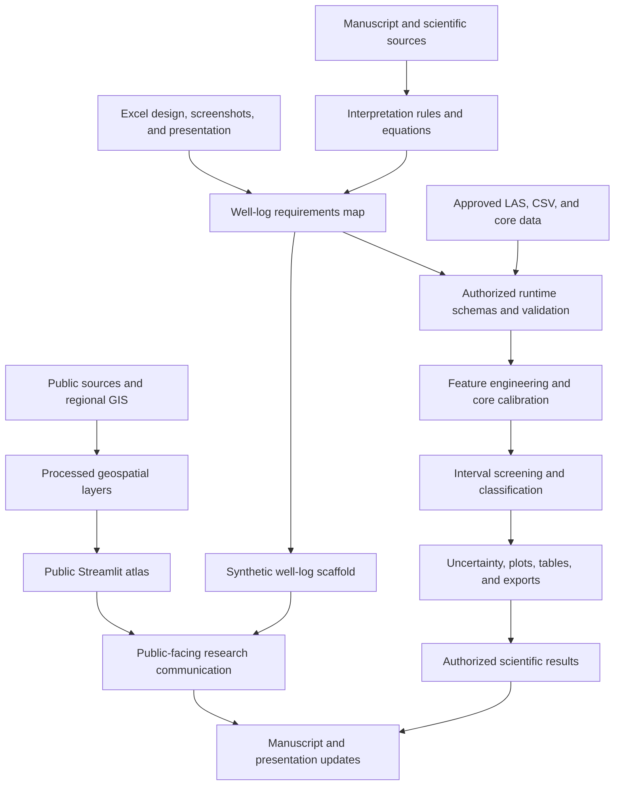

# Project Architecture and Activity Map

Last updated: 2026-07-15

## Purpose

This document answers four questions:

1. What are we building?
2. How do the project components connect?
3. Where are we now?
4. What must happen next?

Update this document after a meaningful milestone, decision, blocker, or change
in priority. Do not record every small edit. New sessions should read
`docs/AGENT_START_HERE.md` first, then use this map for architecture,
workstream status, priorities, and activity history.

## Target Outcome

Create a scientifically defensible North Slope gas-hydrate research system with:

- a public regional GIS and research website; this webiste needs to be private if we are gonna put classified data on it. the main goal is the slides and document the website is kinda of anothe rmiddle man to store skelton structurs that i can bring into the doe virtual desktop into anaconda to like put the datasets in and then run thhe system. i can run jupyter notebook on anaconda so geting thhe vs code stuff is fine probably. i also have access to antigravity its like a agentic ai helper.
- a synthetic well-log demonstration; that is more the end product of our logical reasoning to each paramters ranges and changes that describe gas hydrates. thhat was the visual i dea i came up with for one of the slides to describe how hydrates are being identified in the nort slpe of alska does that make snese?
- an authorized runtime for real well-log and core inputs; im not sure what means like run time whhat do you mean?
- reproducible classification, uncertainty, plots, and exports;  yes! thats whhat the website is for to put a bunch of skeletons in there.
- aligned manuscript and presentation deliverables. for sure

## System Architecture

```mermaid
flowchart TD
    A["Public sources and regional GIS"] --> B["Processed geospatial layers"]
    B --> C["Public Streamlit atlas"]
    D["Manuscript and scientific sources"] --> E["Interpretation rules and equations"]
    F["Excel design, screenshots, and presentation"] --> G["Well-log requirements map"]
    E --> G
    G --> H["Synthetic well-log scaffold"]
    G --> I["Authorized runtime schemas and validation"]
    J["Approved LAS, CSV, and core data"] --> I
    I --> K["Feature engineering and core calibration"]
    K --> L["Interval screening and classification"]
    L --> M["Uncertainty, plots, tables, and exports"]
    C --> N["Public-facing research communication"]
    H --> N
    M --> O["Authorized scientific results"]
    N --> P["Manuscript and presentation updates"]
    O --> P
```

## Data Boundary

### Public Repository

- public GIS inputs and derived regional layers;
- notebooks and reusable code;
- synthetic well-log examples;
- public-source manuscript drafts;
- public website assets and documentation;
- schemas, validation logic, and empty runtime adapters.

### Authorized Runtime Only

- approved or restricted LAS/CSV/core files;
- named restricted well identifiers;
- derived sensitive results;
- populated local configurations;
- fitted models and runtime logs.

The public website must never load authorized runtime data.

## Current ML Architecture Decisions And Open Mentor Questions

### A. Ready to encode now

- The approved-runtime skeleton now treats hydrate occurrence classification
  and saturation regression as linked but separate outputs.
- Occurrence is target/validation evidence from approved sources such as
  core/pressure-core observations, NMR/core-derived saturation, validated log
  interpretation, or documented seismic indicators. Stability is context only.
- Numeric predictors get train-only 0-1 scaling after a whole-well,
  compartment, or geographic split. Depth stays the alignment/context axis
  unless mentor approves predictor use. Units remain visible beside original
  headers.
- Every source variable gets a fingerprint: original header, unit, normalized
  name, role, feature-matrix permission, leakage risk, and unresolved mentor
  question.
- Caliper coverage is checked before washout filtering. Missing caliper creates
  a missing-QC flag rather than an automatic filter.
- Candidate features include `GR`, density porosity, resistivity transforms,
  `Vp`, `Vs`, `Vp/Vs`, impedance, elastic attributes, NMR-density separation,
  and equation-list features only after source, unit, QC, and leakage checks.
- Model order is baselines first, tree/boosting second, and ANN/Keras third.
  Chong et al. 2024 / USGS is the external hydrate ML anchor for occurrence
  classes and saturation prediction:
  <https://pubs.usgs.gov/publication/70250169>.
- Well-MTE is the Mt. Elbert Stratigraphic Test Well and Well-IGS is the Ignik
  Sikumi Test Well; both are Eileen Gas Hydrate Trend case-study wells. Keep
  `MTE_refined` and `IGS_refined` as blue questions until workbook metadata
  confirms raw/refined stages: <https://www.osti.gov/servlets/purl/1893637>.
- Missing-log adapters for `Vp` or `RHOB` are optional and validation-required.
  The MDPI/Naim et al. marine hydrate result supports the idea but not
  automatic North Slope transfer:
  <https://www.mdpi.com/1996-1073/16/23/7709>.

### B. Slide review callouts

For slide work, treat the items above as known architecture decisions, not
unanswered questions. Blue callouts should be reserved for runtime
confirmations that still depend on approved-workbook recovery: target priority
when multiple saturation labels exist, fraction-vs-percent target convention,
occurrence-label provenance, train/validation/locked-test well assignment,
caliper coverage sufficiency, and missing-log adapter permission.

Use the V5.5 mentor update deck and companion as the current local
presentation baseline. V5.4 is the source baseline, and the older Gmail-style
prompt plus V5.2 diagrams remain provenance and visual authority. Treat V5.3
as a flawed intermediate/reference, not the active mentor deck.

## Component Map

| Component | Main location | Current state | Next outcome |
|---|---|---|---|
| Public atlas | `dashboard/app.py` | Four-page Processing-style visual redesign implemented with legacy route aliases; Explore North Slope exposes the guarded stability screen, and Analyze Hydrates now includes Public ML Readiness, Mentor Review, Schema Coverage & Architecture, Target Registry & Leakage, Runtime Readiness, Model Run Tracker, Presentation Exports, and the synthetic ML visual architecture section. The Mentor Review tab consolidates the north star, public-vs-DOE boundary, done/not-claimed/next status, public stability counts, three-dataset prototype status, tracker readiness, mentor decisions, V5.5 local deliverables, runbooks, and source-inventory links without exposing approved rows. The Schema Coverage tab shows public counts, parameter evidence, boundaries, blocked reasons, mentor decisions, intake validator contract, templates, and approved-data field roles. The Model Run Tracker reads ignored local `outputs_runtime/` summaries in DOE and displays run comparisons, target cards, feature-family/exclusion audits, validation-status flags, final-claim blockers, public-safe summary export, dataset inventory, and stability-as-context rules without exposing approved rows. | Polish visuals and keep public/synthetic data boundary verified during deployment |
| Website entry point | `streamlit_app.py` | Public deployment verified | Keep the hosted app synchronized with `main` |
| Synthetic well-log engine | `dashboard/well_log_engine.py` | Working scaffold | Align with Excel design |
| Authorized runtime | `dashboard/runtime/` and `doe_anaconda_final_kit/` | Source-driven readiness, grouped-well split scaffold, three-dataset runtime, local model-run tracker, and GitHub-facing V19-V23 DOE/Anaconda notebooks are implemented. V23 lives at `doe_anaconda_final_kit/DOE_MASTER_ML_PIPELINE_EQUATION_FIRST_V23_WELLC_HOLDOUT_3TO1_REPORT_PIPELINE.ipynb`, defaults to training on WellA+WellB+WellD and testing held-out WellC, validates the row-free review packet artifacts, and keeps row-level predictions, fitted models, and runtime logs in ignored runtime folders. | Download/run V23 on the DOE desktop with `actual_core_data_combined.xlsx` and the approved well-log workbooks; compare its clean-summary sheets, packet audit, per-well/bin bias, and feature-drift outputs against the WellA-held-out packet before making thermogenic/biogenic transfer interpretations |
| Well-log tests | `tests/` | `117 passed, 2 skipped` verified after the DOE model-run tracker review-board and 2026-06-17 V5.5 deck update | Expand with workbook-derived unit, label, and alignment cases |
| GIS pipeline | notebooks and `03_data_final/` | Recovered | Validate only when GIS changes are needed |
| Manuscript | `docs/project_blueprints/` | Two drafts recovered; the local research-overview Word deliverable was rebuilt on 2026-06-13 from the science-to-ML ladder, baseline source ledger, source-backed parameter movements, screening-envelope language, target leakage rules, model ladder, and validation plan; a 2026-06-15 pipeline status and forward workflow Word brief now exists for mentor/project review | Review the pipeline brief and rebuilt local DOCX, then calibrate claims against workbook formulas, approved labels, and recoverable range provenance before any results-bearing revision |
| Presentation | Current local baseline is the V5.5 Slide 2 source update deck generated from `docs/project_blueprints/build_full_workflow_diagram_deliverables.py`: `docs/project_blueprints/V5_5_SLIDE2_SOURCE_UPDATE_North_Slope_Gas_Hydrate_ML_Workflow_Slides_2026-06-17.pptx`. It preserves the original personal opener, nine-slide spine, slide 3 parameter board, full complex workflow on slide 4, equations/unit gates on slide 6, and complex ML runtime architecture on slide 7. Slide 2 is now the accepted three-column context slide: what gas hydrate is, why the Alaska North Slope matters, and why P-T stability is a gate. It uses source-backed hydrate structure/type language with methane/Structure I baseline framing, a DGGS RI 2018-6 Umiat-Gubik central North Slope geology-layer preview, the USGS Arctic Alaska cross section, selected USGS/DOE stability visuals, and the stability-not-proof guardrail. The verified Drive copies are native Google Slides/Docs: `https://docs.google.com/presentation/d/1-35vfTIXAnWCiyKTLooJy80HBYliMBliE_z4CbggJC0` and `https://docs.google.com/document/d/1CyZkRgfAUSOOaRxXni0mcmFN2OQcc5pNOw8TOv44f0Q`. | Ready for mentor review | Use the V5.5 Slide 2 source update package for mentor review; preserve V5.4 and earlier V5.5 as provenance/reference |
| Mentor and deliverable communication | `docs/MENTOR_STATUS_UPDATE_DRAFT.md`, `docs/WEEKDAY_PROGRESS_REPORT_TEMPLATE.md`, `docs/MENTOR_PROJECT_STATUS_PACKAGE_V5_WORKFLOW_2026-06-15.md`, `docs/DELIVERABLE_REFRESH_PLAN_STABILITY_AND_ML.md`, `docs/SLIDE_REMAKE_STORYBOARD_STABILITY_AND_ML.md`, `docs/FULL_PROJECT_ML_WORKFLOW_DIAGRAM.md`, `docs/PIPELINE_STATUS_AND_ML_WORKFLOW_BRIEF.md`, `docs/GMAIL_STYLE_V5_2_SLIDE_REMAKE_PROMPT_2026-06-15.md`, `docs/FINAL_DELIVERABLE_CONSOLIDATION_AND_CLEANUP_PLAN_2026-06-15.md`, `docs/FINAL_NINE_SLIDE_GAP_AND_DIAGRAM_REUSE_PLAN_2026-06-15.md`, `docs/FINAL_NEW_SLIDE_DECK_CREATION_PROMPT_2026-06-15.md` | Drafted public-safe stability-screen status language, mentor questions, weekday reporting template, a diagram-first refresh plan, a superseded first slide storyboard, the full project workflow map, Word-ready status/diagram briefs, a compact V5.2 mentor status package, a Gmail-style V5.2 slide-remake prompt, a final consolidation/cleanup plan, a slide-by-slide gap plan, the final deck-creation prompt, and the V5.5 mentor update package. V5.5 explains the DOE prototype and stability overlay without approved rows, fake metrics, hydrate-result claims, or stability-as-proof language. | Review V5.5 with mentor/user, then sync final Word/PPT language and clean up superseded copies only after approval |
| Approved-data schema and ML architecture | `dashboard/approved_data_intake.py`, `dashboard/parameter_evidence.py`, `dashboard/source_visual_inventory.py`, `dashboard/runtime/three_dataset_pipeline.py`, `01_pipeline/validate_approved_data_headers.py`, `01_pipeline/inspect_three_dataset_headers.py`, `01_pipeline/run_three_dataset_ml_pipeline.py`, `docs/APPROVED_DATA_SCHEMA_COVERAGE_AND_MODEL_ARCHITECTURE_PLAN.md`, `docs/DOE_THREE_DATASET_ML_PIPELINE_RUNBOOK_2026-06-16.md`, `data/public_ml_products/approved_schema_coverage_matrix_2026-06-15.csv`, `data/public_ml_products/approved_data_field_role_table_2026-06-15.csv`, `data/public_ml_products/public_parameter_evidence_registry_2026-06-16.csv`, `data/public_ml_products/source_visual_inventory_2026-06-16.csv`, `docs/APPROVED_DATA_INTAKE_SPEC_2026-06-15.md`, `docs/FIRST_MODEL_EXPERIMENT_PLAN_2026-06-15.md` | Public-safe methodology layer records expected approved-data header families, preserves original headers, separates measured inputs, derived features, QC/alignment fields, calibration/reference fields, target-only saturation fields, and unresolved fields, and now includes V5.2 variable fingerprints, explicit intake readiness functions, CLI header audit reports, normalized parameter evidence bars, source-visual provenance QA, a DOE-local three-workbook sheet/header scanner and train/test runner, synthetic tests, OSL handoff docs, and schema-only runtime templates while only about 3 of 71 datasets are visible for design/runtime prototyping | Use this plan, validator, CLI header audit, three-dataset header scanner/runtime runner, parameter evidence registry, and source-visual inventory as the non-stability ML/readiness baseline; keep approved rows, predictions, fitted models, and row-level metrics in ignored runtime folders unless reviewed for public summary |
| Excel design | Header screenshots recovered; workbook missing | Partial | Confirm formulas, units, and mnemonics from the workbook |
| Source library | Index recovered; 2026-06-13 stability source bundle documented, uploaded locally in OpenScienceLab, connected to a Structural Explorer source panel, paired with a committed public snapshot fallback, extended with public Arctic Slope well-context, G10015 temperature-inventory, sampled G10015 profile points, stability input scaffold, guarded stability screen, public ML feature scaffold, target registry, and leakage guardrail products; the hydrate ML/physics intake also records downloaded OSTI PDFs, official source-page backups, Google Drive PDF references, and a needs-PDF manifest | In progress | Use OpenScienceLab as the heavy-data workbench, commit only derived public-safe stability products, digitize/georeference OM-222 if no ready GIS derivative is found, and continue recovering institution-accessible/public sources |
| Git history | Connected and synchronized with GitHub | Complete | Preserve the normal commit-and-push workflow |

## Workstream Activity Map

| ID | Workstream | Status | Immediate activity | Dependency | Completion signal |
|---|---|---|---|---|---|
| W1 | Recover project artifacts | In progress | Collect the full Excel workbook, remaining manuscript variants, and source files; the header screenshots and PowerPoint are recovered | Access to other laptop | Recovery inventory is complete |
| W2 | Organize source intake | In progress | The public stability source bundle is documented and uploaded locally under `data/source_library/`; committed outputs under `data/public_stability_snapshot/` and `data/public_stability_products/` keep the website usable while raw bundles stay out of Git | W1 | Every recovered file has a location and classification |
| W3 | Extract Excel requirements | In progress | Confirm the three-header-reference map against workbook formulas, units, tool mnemonics, and alignment logic; generated samples remain synthetic only | Full workbook recovery | Approved requirements map is complete |
| W4 | Gap analysis | Waiting | Compare spreadsheet requirements with the current engine and runtime package | W3 | Missing and existing capabilities are listed |
| W5 | Implement well-log scaffold | In progress | Runtime Readiness, source-derived QC, target contracts, grouped-well split planning, three-dataset runtime, multi-saturation transfer workflow, and Model Run Tracker are implemented; next add workbook-derived stability joins and validation-ready evaluation | W3, W4 | Requirements are implemented with tests |
| W6 | Website integration and QA | In progress | Four-page navigation, legacy aliases, Processing-style public/synthetic visual sections, consolidated Explore/Analyze/Project Plan pages, ML architecture sketches, stability snapshot fallback, public well stability-context metrics, G10015 temperature-inventory metrics, stability input scaffold, guarded screen visuals, Public ML Readiness, Mentor Review, Schema Coverage & Architecture, Target Registry & Leakage, and Presentation Exports are implemented; website work is limited to public delivery products from the OSL workbench | W5 for final workflow | Hosted deployment shows the four-page visual workflow with responsive QA and no data-boundary regression |
| W7 | Scientific alignment | Partial | Use `docs/SCIENCE_TO_ML_LOGIC_LADDER.md`, `docs/ML_PIPELINE_BASELINE_SOURCE_LEDGER.md`, and the stability calculation docs to reconcile hydrate habits, parameter tiers, parameter movement patterns, screening-envelope ranges, equations, guardrails, model options, and interpretation rules across code, manuscript, and presentation | W1, W3, W5 | No material scientific contradictions remain |
| W8 | Git and project stabilization | Complete | Keep local `main` synchronized with `origin/main` and preserve focused commits | None | Clean history, remote, and documented workflow |
| W9 | Authorized-data execution | In progress | Three approved workbooks can be scanned/trained locally; the GitHub-facing DOE/Anaconda notebook set now includes V23 for the missing WellC-held-out 3-to-1 comparator. V23 trains on WellA+WellB+WellD, tests held-out WellC, writes runtime outputs only to ignored folders, and the final export verifies row-free review packet artifacts before opening the Outlook draft. | W5, authorization, approved well-log workbooks, `actual_core_data_combined.xlsx`, DOE/Anaconda sklearn environment | Reproducible authorized outputs exist with mentor-reviewed target authority, explicit development-vs-blind validation language, reviewed stability/core usage, and V22/V23 packets that include the required clean-summary sheets plus row-free CSV/JSON evidence |
| W10 | Word and PowerPoint deliverables | In progress | Review the V5.5 local PPTX, Word companion, slide panels, and contact sheet; keep using `docs/FINAL_DELIVERABLE_CONSOLIDATION_AND_CLEANUP_PLAN_2026-06-15.md` before deleting, archiving, renaming, or importing older deliverables | W3, W5, W7 | Final Word, final nine-topic deck, and Drive cleanup plan are synchronized with no unsupported results claims |
| W11 | Stability-screen communication | In progress | Use the mentor update, weekday template, V5.5 workflow package, and completed stability-source scaffold to describe OpenScienceLab as the heavy-data workbench, GitHub/Streamlit as the public delivery surface, and the current stability workflow as an admissibility screen and ML overlay context only | W7, W9, W10 | Mentor-facing language and refresh diagrams are approved without claiming hydrate proof, saturation, or sweet-spot ranking |
| W12 | Public ML feature scaffold | Ready | `public_ml_feature_scaffold_2026-06-15.csv`, summary, dictionary, and the Analyze Hydrates Public ML Readiness panel now expose real public feature coverage while keeping occurrence/saturation labels unavailable | W7, W11 | Mentor can see which public features exist, which rows are constrained, and why no public row is training-ready yet |
| W13 | Target registry and leakage barrier | Ready | `public_ml_target_registry_2026-06-15.csv`, `public_ml_leakage_guardrails_2026-06-15.csv`, and the Analyze Hydrates Target Registry & Leakage panel codify that saturation/ground-truth headers are target-only | W3, W7, W12 | Saturation and interpreted-label columns are visibly separated from input features before approved-data schema mapping begins |
| W14 | Approved-data schema coverage and model architecture | Ready | `APPROVED_DATA_SCHEMA_COVERAGE_AND_MODEL_ARCHITECTURE_PLAN.md`, the public ML schema coverage matrix, the field-role table, the minimum intake spec, the first model experiment plan, `dashboard/approved_data_intake.py`, `01_pipeline/validate_approved_data_headers.py`, synthetic validator/CLI tests, public-safe runtime templates, demo header-audit reports, the OSL runbook, and the Analyze Hydrates Schema Coverage & Architecture tab now show the variable-fingerprint contract, X_allowed/Y-only separation, caliper-first QC, missing-log adapter decision, separate occurrence/saturation tasks, header-only OSL handoff, and validation-before-training rules | W3, W7, W13 | Mentor can see a tested ML/schema/intake contribution outside the stability screen, with no final training or metrics claimed |
| W15 | Presentation exports and visual provenance QA | Ready | `data/public_ml_products/source_visual_inventory_2026-06-16.csv`, `docs/SOURCE_VISUAL_INVENTORY_2026-06-16.md`, `dashboard/source_visual_inventory.py`, `tests/test_source_visual_inventory.py`, and Analyze Hydrates > Presentation Exports now preview/download V5.5 slide-ready panels while validating local paths, source status, uncited/AI-looking flags, and guardrails | W6, W10, W14 | Website can supply deck-ready visuals and provenance QA before any slide/Word revision |

Status vocabulary: `Ready`, `In progress`, `Waiting`, `Blocked`, `Partial`,
`Complete`, or `Future`.

## Current Priority

Start future sessions with `docs/AGENT_START_HERE.md`,
`docs/CURRENT_ARTIFACT_INDEX.md`, and `docs/PROJECT_PROMPT_LIBRARY.md` before
diving into the longer project base. These files now define the short handoff
layer for current state, authoritative files, guardrails, deliverables, tests,
and reusable prompts.

Improvement decisions should follow
`docs/PROJECT_IMPROVEMENT_STRATEGY.md`. For the next Word, PowerPoint, or
website edit, review `docs/PROJECT_DIRECTION_LOCK_FOR_REVIEW.md` and
`docs/SCIENCE_TO_ML_LOGIC_LADDER.md`, then use
`docs/ML_PIPELINE_BASELINE_SOURCE_LEDGER.md` so the goal, audience,
deliverable order, science-to-ML narrative, parameter tiers, source-backed
pipeline choices, model guardrails, and public-data boundary stay explicit. The
V5.5 Slide 2 source update Word/PPT rebuild is now the working local
mentor-review base and has verified Drive copies. V5.4 remains
the source baseline and its Drive copies remain reference. V5.3 is a flawed
intermediate/reference, not the active mentor deck. For the
stability-screen communication pass, use
`docs/MENTOR_STATUS_UPDATE_DRAFT.md`,
`docs/WEEKDAY_PROGRESS_REPORT_TEMPLATE.md`, and
`docs/MENTOR_PROJECT_STATUS_PACKAGE_V5_WORKFLOW_2026-06-15.md`, plus
`docs/DELIVERABLE_REFRESH_PLAN_STABILITY_AND_ML.md` to keep the mentor update,
weekday reporting, and planned Word/PPT refresh aligned. Use
`docs/PIPELINE_STATUS_AND_ML_WORKFLOW_BRIEF.md` as the plain-language review
base for where the project stands now and how the future approved-data ML
pipeline reaches occurrence classification and saturation regression. Use
`docs/FULL_PROJECT_ML_WORKFLOW_DIAGRAM.md` as the source for the current V5.5
Slide 2 source update package. Use the current V5.5 diagram assets for that
purpose: the rebuilt source-backed context panel, parameter range panel, full
complex workflow plate, DOE three-dataset prototype/model-run card,
equations/unit-gate slide, complex ML runtime detail, stability-to-ML overlay,
done/not-claimed/next panel, and V5.5 Slide 2 source update contact sheet. The
V5.5 Slide 2 source update PPTX/Word companion are the active
local mentor-facing workflow package:
`docs/project_blueprints/V5_5_SLIDE2_SOURCE_UPDATE_North_Slope_Gas_Hydrate_ML_Workflow_Slides_2026-06-17.pptx`
and
`docs/project_blueprints/V5_5_SLIDE2_SOURCE_UPDATE_North_Slope_Gas_Hydrate_ML_Workflow_Companion_2026-06-17.docx`.
The targeted Gmail-style local deck at
`docs/project_blueprints/North_Slope_Gas_Hydrate_Reservoir_Characterization_Research_Overview.pptx`
and V5.2 workflow package remain provenance unless that format is requested.
Treat the earlier
`docs/project_blueprints/STABILITY_ML_REMAKE_9_SLIDE_North_Slope_Gas_Hydrate_Slides_2026-06-15.pptx`
as superseded provenance unless the user explicitly asks to revive it. The
project will prioritize scientific traceability and runtime readiness over
adding disconnected pages or opaque classification features. For the
non-stability ML layer, use
`docs/APPROVED_DATA_SCHEMA_COVERAGE_AND_MODEL_ARCHITECTURE_PLAN.md`,
`data/public_ml_products/approved_schema_coverage_matrix_2026-06-15.csv`,
`data/public_ml_products/approved_data_field_role_table_2026-06-15.csv`,
`docs/APPROVED_DATA_INTAKE_SPEC_2026-06-15.md`, and
`docs/FIRST_MODEL_EXPERIMENT_PLAN_2026-06-15.md`, plus
`dashboard/approved_data_intake.py`,
`01_pipeline/validate_approved_data_headers.py`,
`docs/OSL_APPROVED_DATA_HEADER_AUDIT_RUNBOOK_2026-06-15.md`, and the
public-safe templates/reports under `data/public_ml_products/`, as the current
schema-readiness and method baseline. Only about 3 of 71 datasets are visible
for schema design, which supports intake planning, header-only OSL audit,
validator testing, and architecture design but not final training, public model
metrics, occurrence probabilities, or saturation predictions.

### Priority 1: Confirm Inputs and Targets

On the source laptop, gather:

- the full Excel workbook and any additional header/formula references;
- manuscript and equation-map documents;
- the public source library and its inventory.

Create one recovery folder, preserving original filenames and folder structure.
Do not mix restricted data into the public recovery package.

### Priority 2: Build the Requirements Map

After recovery, create `docs/WELL_LOG_REQUIREMENTS_MAP.md` containing:

- workbook sheet and screenshot reference;
- source variable and unit;
- formula or interpretation rule;
- required input and validation;
- target runtime module;
- target website display;
- expected export;
- test case and acceptance criterion.

### Priority 3: Implement, Validate, and Build Deliverables

Use the requirements map to make focused code changes, add tests, and visually
inspect the Streamlit workflow. Keep the Word document and the corrected
9-slide PowerPoint deck synchronized as workbook formulas, target provenance,
and approved-data figures become available.

## Blockers and Risks

| Item | Impact | Resolution |
|---|---|---|
| Full Excel workbook is not in this folder | Requirements and labels cannot be finalized | Recover from the source laptop |
| Exact saturation and phase-label fields are not confirmed | Models cannot be trained defensibly until known-well targets are mapped | Confirm the authoritative saturation field, NMR-derived or otherwise supplied saturation targets, phase labels, and uncertain-label convention |
| Connected Drive may be the wrong Google account | Some uploaded sources may remain hidden | Check the account used on the other laptop |
| June 6 migration was a failed local test | Source library was not actually uploaded | Repeat migration only after verifying real paths and destination |
| Public and restricted files could be mixed | Data-governance and publication risk | Classify every recovered item before copying |

## Near-Term Sequence

1. Recover the missing Excel artifacts and remaining public sources.
2. Create a recovery inventory with data classification.
3. Confirm the exact saturation target, NMR target role, and phase labels; refine the approximately 14-known / 57-prediction well plan after inventory.
4. Build the well-log requirements map.
5. Perform the code-to-requirements gap analysis.
6. Use the implemented Runtime Readiness, grouped-well split scaffolds, and Model Run Tracker to review workbook-derived rules, cleaned feature matrices, baseline models, and stability-context joins.
7. Use the approved-data schema coverage matrix, field-role table, intake spec,
   intake validator, public-safe templates, and first model experiment plan to
   resolve target authority, saturation units, sheet/source identity, required
   curves, QC fields, blocked conditions, and validation wells before final
   model training.
8. Get mentor decisions on phase-curve policy, official occurrence/saturation
   target authority, validation split, missing G10015 temperature handling,
   stability-as-context-only policy, and acceptable public website outputs
   before approved validation.
9. Review the 2026-06-15 pipeline status Word brief, the targeted
   2026-06-15 Gmail-style local PPTX, and the 2026-06-13
   local Word/PPT rebuild against
   `docs/FINAL_DELIVERABLE_CONSOLIDATION_AND_CLEANUP_PLAN_2026-06-15.md`,
   `docs/GMAIL_STYLE_V5_2_SLIDE_REMAKE_PROMPT_2026-06-15.md`,
   `docs/PROJECT_DIRECTION_LOCK_FOR_REVIEW.md`,
   `docs/SCIENCE_TO_ML_LOGIC_LADDER.md`,
   `docs/ML_PIPELINE_BASELINE_SOURCE_LEDGER.md`,
   `docs/ML_CITATION_PACKET_FOR_DELIVERABLES.md`, and
   `docs/deliverable_revision_base_2026_06_12/`, so source claims,
   hydrate-system framing, parameter tiers, baseline pipeline choices, ML
   explanation, format rules, and visual language stay synchronized.
10. Keep the Word and PowerPoint deliverables synchronized as workbook formulas,
   approved labels, and final figures become available.
11. Polish and deploy the implemented four-page Processing-style website redesign.
12. Run complete website visual QA.
13. Keep the architecture tracker, tests, commits, and hosted deployment synchronized.

## Key Decisions

- The repository root is the official working folder.
- `docs/AGENT_START_HERE.md` is now the first-read file for future Codex, PC,
  and OpenScienceLab sessions.
- `PROJECT_CONTEXT.md` holds concise project orientation.
- This document is the authoritative architecture, activity, and next-work map.
- The classification-methods draft is the primary scientific methods direction.
- The public website remains public-source and synthetic only.
- Real approved data remains in the authorized runtime environment.
- `docs/PROJECT_DIRECTION_LOCK_FOR_REVIEW.md` is the editable goal-lock draft
  for the next Word/PPT/website pass.
- `docs/SCIENCE_TO_ML_LOGIC_LADDER.md` is the current spine for the next
  Word/PPT pass: define the hydrate system first, use three parameter tiers,
  label numeric ranges as screening envelopes, and route targets through a
  leakage barrier.
- `docs/ML_PIPELINE_BASELINE_SOURCE_LEDGER.md` is the current source-backed
  option ledger for how the pipeline should treat inputs, feature engineering,
  parameter movement patterns, target leakage, guardrails, model choices,
  validation, and outputs.
- `docs/APPROVED_DATA_SCHEMA_COVERAGE_AND_MODEL_ARCHITECTURE_PLAN.md` and the
  public ML schema coverage matrix are the current non-stability ML/schema
  readiness baseline. They support architecture design from visible headers and
  screenshots, not final training, performance metrics, or hydrate prediction
  claims.
- `data/public_ml_products/approved_data_field_role_table_2026-06-15.csv`,
  `docs/APPROVED_DATA_INTAKE_SPEC_2026-06-15.md`, and
  `docs/FIRST_MODEL_EXPERIMENT_PLAN_2026-06-15.md` are the current
  approved-data readiness contract. They define what needs to be loaded later
  in the authorized runtime and keep occurrence/saturation labels on the
  Y-only side until target authority is approved.
- `dashboard/approved_data_intake.py`, `tests/test_approved_data_intake.py`,
  and the schema-only public templates in `data/public_ml_products/` are the
  runnable public-safe version of that contract. They validate headers,
  leakage controls, blocked reasons, target authority metadata, and split
  readiness without reading approved rows.
- Stability-screen communication must say stability-admissibility only. It
  must not claim hydrate proof, saturation, final stability results, or
  sweet-spot ranking before approved-data validation.

## Important Activity Log

| Date | Activity | Result |
|---|---|---|
| 2026-07-15 | Added V23 WellC-held-out DOE/Anaconda comparator | Added `doe_anaconda_final_kit/DOE_MASTER_ML_PIPELINE_EQUATION_FIRST_V23_WELLC_HOLDOUT_3TO1_REPORT_PIPELINE.ipynb` so the primary split trains on WellA+WellB+WellD and tests held-out WellC, with the same row-free review packet audit/checklist behavior as the hardened V22 notebook. |
| 2026-07-13 | Fixed the V20 email/share packet export contract | Updated the V20 notebook final block so clean summaries, ZIPs, review folders, and Outlook drafts include validated row-free V20 comparison sheets and fail before email creation if required V20 outputs are missing |
| 2026-06-16 | Organized the future-agent handoff base | Added `docs/AGENT_START_HERE.md`, `docs/CURRENT_ARTIFACT_INDEX.md`, and `docs/PROJECT_PROMPT_LIBRARY.md`; updated the context, project base, and architecture map so future sessions start from one short file set before deeper docs |
| 2026-06-07 | Recovered the working project from a prior Codex session | Website, notebooks, GIS layers, Word drafts, and runtime scaffold restored |
| 2026-06-07 | Verified focused well-log/runtime tests | 8 tests passed |
| 2026-06-07 | Investigated source migration and Google Drive | Confirmed the migration was a failed local test and identified the source-laptop paths |
| 2026-06-08 | Established architecture and activity tracking | This document became the authoritative next-work map |
| 2026-06-08 | Added roadmap to Streamlit and responsive mobile styling | Architecture status is available inside the website and narrow screens stack key layouts |
| 2026-06-08 | Identified the hosted Streamlit deployment | Saved the canonical URL and found that anonymous access is currently disabled |
| 2026-06-08 | Verified Git synchronization and improved the mobile roadmap | Local `main` matches `origin/main`; narrow screens receive workstream cards and a clearer next-project move |
| 2026-06-08 | Made the hosted Streamlit deployment public | Anonymous requests reach the app without a Streamlit access-denied response |
| 2026-06-08 | Defined the project improvement strategy | Established product pillars, a feature decision test, phased priorities, and ML guardrails |
| 2026-06-08 | Reviewed normalized Excel header screenshots | Kept the images out of Git and the website; retained only a public-safe header/schema requirements map |
| 2026-06-08 | Reviewed connected Drive research and strengthened the synthetic scaffold | Added a seven-domain explainable sweet-spot model and documented the boundary between scientific tendencies and synthetic thresholds |
| 2026-06-08 | Added the focused North Slope Sweet Spots page | Combined ranked synthetic intervals, input variables, geomechanics, uncertainty, competing explanations, and sources in one decision workspace |
| 2026-06-08 | Expanded and tiered sweet-spot source provenance | Distinguished ten primary public references from 28 indexed project artifacts and the four-document Drive synthesis subset |
| 2026-06-08 | Integrated project-direction emails and the attached ML paper | Added the vision/goals/next-steps tracker, clarified deliverable priority and validation requirements, and recovered the PowerPoint scaffold from Gmail |
| 2026-06-08 | Implemented source-driven runtime and deliverable changes | Added curve/output readiness, Chong feature contracts, caliper washout QC, grouped-well splits, target provenance, and an eight-slide deck specification |
| 2026-06-08 | Planned the website navigation and visual redesign | Defined a four-page information architecture, overview visual prompts, icon/color rules, staged change sets, and mobile acceptance criteria before implementation |
| 2026-06-08 | Confirmed the working ML cohort assumptions | Recorded approximately 71 wells, 20% known wells for development, 80% prediction wells, and separate classification and saturation outputs |
| 2026-06-09 | Updated NMR availability and regenerated deliverables | Recorded that NMR and all screenshot-listed fields are available; created a crisp research-overview Word document and eight-slide PowerPoint |
| 2026-06-09 | Revised deliverables from emailed instructions | Word now fills abstract/introduction and leaves later sections as outline placeholders with process sketches; PowerPoint now uses the requested nine-slide structure |
| 2026-06-09 | Embedded website visuals into the PowerPoint | Added generated 3D regional context, synthetic well-log panel, ML validation placeholder, and sweet-spot ranking images to the nine-slide deck |
| 2026-06-09 | Strengthened the ML architecture and map slides | Updated the live Google Slides deck and reproducible PPTX with Chong et al. ANN source-paper context, classification/regression branches, target-leakage guardrails, complete-well validation, and a refreshed Streamlit Structural Explorer 3D map image with a live-app link |
| 2026-06-09 | Re-exposed the website log scaffold | Added a first-class `Log Scaffold` navigation entry, kept the legacy `Future Well-Log Engine` query alias, and added a welcome-page link so the synthetic well-log/runtime scaffold is visible again |
| 2026-06-10 | Audited the website for a Processing-style visual redesign | Added `docs/WEBSITE_PROCESSING_VISUAL_AUDIT.md` with a page-by-page current-format to target-format map before implementation changes |
| 2026-06-10 | Implemented the Processing-style website redesign | Reduced the Streamlit site to Overview, Explore North Slope, Analyze Hydrates, and Project Plan; added public/synthetic canvas sketches, consolidated old pages into three-tab workflows, preserved legacy route aliases, and verified desktop/mobile rendering |
| 2026-06-10 | Clarified header-derived synthetic data provenance | Recorded that only three Excel header references are available and that website/test sample rows are generated synthetic records, not user-supplied well-log data |
| 2026-06-10 | Rebuilt Word and PowerPoint deliverables after website redesign | Regenerated the research-overview DOCX/PPTX with header-derived synthetic-data provenance, source anchors, the subsurface evidence stack, and the four-page Streamlit workflow |
| 2026-06-10 | Reintegrated the DOE-sent updated deliverables | Recovered the user's Gmail-sent Word document and PowerPoint to the DOE account, used them as the base tracked deliverables, and patched in the latest website visuals, source anchors, and public/runtime boundary |
| 2026-06-10 | Added ML visual architecture sketches | Created a source-backed ML visual plan and added Processing-style header-to-model knowledge graph and hydrate decision-tree sketches to the active Analyze Hydrates workflow |
| 2026-06-10 | Recorded the user-approved deck revamp direction | Shifted priority back to Word/PPT, added a parameter signal and masking-tree plan, and created a machine-readable parameter/effect matrix for the upcoming PowerPoint rebuild |
| 2026-06-10 | Rebuilt the latest Drive PowerPoint as a visual ML architecture deck | Generated a 12-slide public-safe PPTX with parameter signal bars, conceptual importance weights, masking/effect trees, MLOps-style architecture maps, parallel classification/regression branches, and overburden/sweet-spot review visuals; imported it to Drive as `REVAMPED June 10 North Slope Gas Hydrate ML Parameter Architecture Slides` |
| 2026-06-10 | Aligned the Word deliverable with the ML deck revamp | Regenerated the research-overview DOCX from the reproducible builder using the same parameter/effect matrix, expanded the methodology and ML validation sections, preserved the website/source-integration section, and changed the builder default so it no longer overwrites the current ML deck |
| 2026-06-11 | Corrected the Drive deck to the requested 9-slide final revision | Added `docs/NINE_SLIDE_POWERPOINT_REVISION_WORKFLOW.md`, rebuilt the parameter matrix with measurement/caveat/model-role language, restored the profile photo on slide 1, added named ML feature equations including acoustic impedance and NMR-density separation, regenerated the local PPTX, imported the verified native Google Slides deck as `FINAL 9-SLIDE REVISION North Slope Gas Hydrate ML Parameter Architecture Slides 2026-06-11`, and confirmed 23 tests passed |
| 2026-06-11 | Restored the older deck topic sequence with stronger ML visuals | Rebuilt the local PPTX and imported the verified native Google Slides deck as `FINAL TOPIC-ALIGNED ML VISUAL REVISION North Slope Gas Hydrate Slides 2026-06-11`; the deck keeps exactly 9 slides, restores the older slide topics, keeps the profile photo, and connects equations, feature logic, complete-well splits, target-leakage prevention, classification/regression branches, and error review in the ML section |
| 2026-06-11 | Folded the Classification Methods Draft into the final deck | Regenerated and imported `FINAL CLASSIFICATION-METHODS ML VISUAL REVISION North Slope Gas Hydrate Slides 2026-06-11`; the verified 9-slide deck keeps the older topic sequence while adding six interpretation gates, well/compartment validation, model-ladder rationale, probability calibration, reason-code outputs, and results/discussion review flags |
| 2026-06-11 | Recovered and integrated the latest Gmail ML sources | Added `s10596-022-10151-9.pdf` and `ML_Project_Reference_and_CreditScoreV4_Case_Notes.docx` to `references/ml-sources/2026-06-11/`, documented their public-safe source roles, enriched the fixed 9-slide local deck builder, and expanded the Word builder with Chong et al. ANN workflow details plus leakage-safe preprocessing, data-quality, validation, calibration, residual, and drift-monitoring controls |
| 2026-06-11 | Imported the enriched deliverables to Google Drive | Imported the enriched local DOCX and PPTX into the connected Google Drive account as native files named `ENRICHED ML PIPELINE North Slope Gas Hydrate Research Overview 2026-06-11` and `ENRICHED 9-SLIDE ML PIPELINE North Slope Gas Hydrate Slides 2026-06-11`; Drive readback verified both files exist and the Slides deck contains exactly 9 slides |
| 2026-06-11 | Prepared the slide 1-6 visual revision package | Added `references/presentation-revision-2026-06-11/` with public-domain USGS image assets, the current Streamlit structural explorer asset, a source manifest, reusable parameter icon registry, slide-by-slide plan, and detailed change prompt for the next PowerPoint pass |
| 2026-06-11 | Executed the all-slide visual revision and Drive upload | Rebuilt the local 9-slide PPTX with about-me/title polish, current Streamlit structural explorer, public gas-hydrate and log-image assets, parameter symbol chips, corrected QC-gate ML architecture, behavior panels, geomechanical sketch, results visuals, and conclusion graphics; imported it as native Google Slides named `FINAL VISUAL REVISION 9-SLIDE North Slope Gas Hydrate Slides 2026-06-11`; Drive metadata/readback verified a native 9-slide deck and Google-rendered thumbnails were checked for all slides |
| 2026-06-12 | Executed the latest Gmail visual-feedback deck pass | Recovered the user's latest Gmail instructions and inline visual references, generated nine source-backed Processing-style raster panels, rebuilt the local PPTX, imported it to Drive as native Google Slides named `GMAIL VISUAL REVISION 9-SLIDE North Slope Gas Hydrate Slides 2026-06-11`, verified Drive metadata/readback plus large thumbnails for all nine slides, and confirmed 23 project tests pass |
| 2026-06-12 | Scoped the next deck edit to slide 2 | Added `references/presentation-revision-2026-06-11/slide_02_instruction_sheet.md` with the desired gas-hydrate introduction story, layout, visual assets, source basis, implementation prompt, and acceptance checklist before touching the deck |
| 2026-06-12 | Rebuilt slide 2 with source-backed hydrate visuals | Updated the Processing-style slide asset to lead with the USGS SEM image, clathrate cage symbol, manually rendered `CH4`/`H2O` subscripts and hydrate dot, USGS/NETL definition stream, P-T stability gate, and North Slope context; replaced only slide 2 in the current Drive deck and verified the fresh Google-rendered thumbnail |
| 2026-06-12 | Audited ML source coverage for the next Word/PPT pass | Added `docs/ML_SOURCE_COVERAGE_AND_DELIVERABLE_REVISION_PLAN.md` to separate primary North Slope science, direct permafrost ML evidence, comparative ML methods, project synthesis, and general ML controls before further deliverable edits |
| 2026-06-12 | Created the Word/PPT deliverable revision base | Added `docs/deliverable_revision_base_2026_06_12/` with the Gmail instruction digest, current PPTX/DOCX audit, source registry, format rules, slide-to-Word alignment matrix, and next execution checklist; website work is explicitly out of scope except for app/runtime skeleton and reusable visuals |
| 2026-06-12 | Added the project direction review lock | Added `docs/PROJECT_DIRECTION_LOCK_FOR_REVIEW.md` so the user can revise the shared goal, audience, deliverable order, science/ML rules, data boundary, open decisions, and acceptance criteria before further Word, PowerPoint, or website edits |
| 2026-06-12 | Verified the comparative ML citation packet | Added `docs/ML_CITATION_PACKET_FOR_DELIVERABLES.md` with ready-to-cite Chong et al. (2022), Singh et al. (2021), and Chong et al. (2024) entries, allowed Word/slide language, and guardrails against using comparative sources as North Slope field truth |
| 2026-06-13 | Connected the stability source bundle to the Structural Explorer | Added `dashboard/stability_sources.py`, GeoPandas-backed parsing for NSIDC GGD223 permafrost-depth controls and USGS hydrate assessment-unit GeoJSON, a Structural Explorer source-status/map panel, source-library scan exclusions, and tests for parser/UI behavior |
| 2026-06-13 | Captured the science-to-ML logic ladder | Added `docs/SCIENCE_TO_ML_LOGIC_LADDER.md` with hydrate habits, three parameter tiers, screening-envelope ranges, equations, and ML pipeline language; wired it into the deliverable revision base and project direction tracker while marking the user-reported range DOCX files as pending local recovery |
| 2026-06-13 | Retrieved hydrate ML and physics source files | Added `references/hydrate-ml-physics-sources/2026-06-13/` with downloaded OSTI PDFs for Singh et al. (2021) and Chong et al. (2024), official source-page backups for Lee and Collett (2011), Cook and Waite (2018), and Chong et al. (2024), plus a manifest identifying sources still needing user-provided or institutional PDFs |
| 2026-06-13 | Registered five Google Drive source PDFs | Recorded user-uploaded Drive PDFs for Aung et al. (2026), Yoneda et al. (2026), Tian et al. (2023), Li and Liu (2020), and Naim et al. (2023) in `references/hydrate-ml-physics-sources/2026-06-13/google_drive_uploaded_sources_2026_06_13.md` and updated the source manifest/source registry |
| 2026-06-13 | Created the baseline ML pipeline source ledger | Added `docs/ML_PIPELINE_BASELINE_SOURCE_LEDGER.md` to preserve source-backed claims, pipeline options, benefits, issues, parameter movement patterns, screening ranges, target leakage rules, model choices, validation controls, and Word/PPT implications before rebuilding deliverables |
| 2026-06-13 | Rebuilt the local Word and PowerPoint deliverables | Regenerated the research-overview DOCX and exactly 9-slide PPTX from the science-to-ML ladder and baseline source ledger; kept the deliverables public-safe, results-free, and local-only pending review |
| 2026-06-13 | Uploaded the science-to-ML deliverables to Google Drive | Imported the rebuilt DOCX/PPTX as native Google Docs/Slides files named `SCIENCE-TO-ML North Slope Gas Hydrate Research Overview 2026-06-13` and `SCIENCE-TO-ML 9-SLIDE North Slope Gas Hydrate Slides 2026-06-13`; connector readback verified native MIME types, document text, 9-slide structure, and all nine slide thumbnails |
| 2026-06-14 | Locked the OpenScienceLab-to-website stability workflow | Recorded that OpenScienceLab is the heavy-data workbench for raw bundles and parsing, while GitHub/Streamlit receives only compact public-safe derived outputs; added the public stability snapshot fallback so the website can render GGD223 controls and USGS hydrate AUs without relying on fragile OpenScienceLab proxy links |
| 2026-06-14 | Built the public well and temperature stability-context products | Added `dashboard/stability_products.py` and `data/public_stability_products/` to join public Alaska DNR Arctic Slope wells with nearest GGD223 permafrost-depth controls and USGS hydrate AU membership, plus a compact G10015 processed temperature-log inventory; Structural Explorer now shows summary metrics, preview tables, and CSV downloads while clearly labeling the products as context rather than hydrate proof |
| 2026-06-14 | Added stability pipeline readiness guardrail | Added a Structural Explorer readiness table that separates ready public inputs from partial/planned inputs, keeping pressure assumptions, hydrate phase curve, and final stability top/base/thickness calculation marked as unfinished |
| 2026-06-14 | Added the stability input scaffold | Added a public-safe scaffold that joins well depth, nearest GGD223 permafrost context, representative G10015 temperature context, and provisional hydrostatic pressure while keeping phase-curve and final stability-zone results uncalculated |
| 2026-06-14 | Prepared next-chat stability handoff | Added `docs/NEXT_CHAT_STABILITY_PHASE_CURVE_PROMPT.md` and updated the base with the complete OSL-derived product status: 184 G10015 profiles, 483 temperature matches, and 374 phase-curve-ready scaffold rows |
| 2026-06-14 | Built the stability calculation plan | Added `docs/STABILITY_CALCULATION_PLAN.md` with the hydrostatic pressure equation, G10015/GGD223 temperature model hierarchy, methane 5 ppt phase-curve lookup source, source-control confidence labels, caveats, and the `stability_screen_*.csv` schema before committing guarded screen outputs |
| 2026-06-14 | Added the cited methane hydrate phase-curve lookup | Added `data/public_stability_products/phase_curve_methane_5ppt_sir2008_csmhyd_digitized_v1.csv`, pressure helpers for gauge versus absolute hydrostatic pressure, and phase-curve interpolation tests anchored to USGS SIR 2008-5175 Figure 1A while still keeping final stability top/base/thickness uncalculated |
| 2026-06-14 | Made phase-curve selection scenario-capable | Added `phase_curve_scenario_catalog_2026-06-14.csv` and scaffold metadata for curve role, allowed use, gas fractions, and salinity so the mentor-approved 100 percent methane curve remains the official baseline while mixed-gas North Slope chemistry stays sensitivity-only until digitized or model-generated |
| 2026-06-14 | Added the stability input capability matrix | Added `stability_input_capability_matrix_2026-06-14.csv`, a tested public input contract that separates ready public inputs, baseline assumptions, scenario-only inputs, and blocked future approved-data inputs before any stability or ML claim is made |
| 2026-06-14 | Added OSL pull triggers and website stability target spec | Added `stability_osl_pull_triggers_2026-06-14.csv` and `stability_website_product_spec_2026-06-14.csv` so the team knows when raw G10015/OSL work is needed and what the final public stability website should show without overclaiming |
| 2026-06-14 | Added fixture-tested temperature-model helpers | Added G10015-style profile-point parsing plus measured-profile interpolation, gradient-based below-profile extrapolation, and blocked-status handling for missing temperature inputs; this advances the local implementation gate without producing final stability top/base/thickness |
| 2026-06-14 | Added fixture-tested stability intersection helpers | Added inclusive depth-grid construction, per-depth pressure-temperature stability flags, interpolated synthetic top/base crossing tests, open-base extrapolation caveats, and blocked incomplete-grid behavior while keeping the public scaffold uncalculated |
| 2026-06-14 | Added source-control confidence label tests | Added high, medium, low, blocked, and outside-AU confidence-label helper tests for stability-screen rows while preserving the rule that confidence labels are not hydrate occurrence, saturation, or sweet-spot claims |
| 2026-06-14 | Prepared the OSL temperature-model product writer | Updated the public stability pipeline so an OSL run with raw G10015 processed profile files can write compact temperature-model key-depth rows and a summary while leaving stability top/base/thickness uncalculated |
| 2026-06-14 | Added the guarded baseline stability-screen writer | Added fixture-tested screen-writing logic that fills top/base/thickness only for rows passing all source and calculation gates, leaves blocked rows null, and preserves `not_hydrate_proof` caveats before the OSL screen run |
| 2026-06-14 | Committed the first guarded OSL stability screen | Added the methane 5 ppt `stability_screen_2026-06-14_methane_5ppt_v1.csv` output with 8,084 rows, 22 calculated intervals, 8 no-stable-interval rows, 8,054 blocked rows, and no hydrate-proof claim |
| 2026-06-14 | Exposed the guarded stability screen in the app | Added the Structural Explorer display for the baseline methane 5 ppt screen, including summary metrics, status/confidence breakdowns, calculated interval preview, blocked/no-interval sample, and download while preserving the no-proof caveat |
| 2026-06-14 | Added visual stability-screen views | Added a 2D well-status map plus a calculated interval depth chart so the 22 baseline intervals and the blocked/gap rows can be understood visually without turning the screen into hydrate proof |
| 2026-06-14 | Added blank-row and proxy-temperature diagnostics | Added website tabs explaining blank-row causes, G10015/GGD223 coordinate crosswalk coverage, nearest located G10015 control distance, proxy-candidate tiers, source anchors, diagnostic CSV export, and regression tests while keeping proxy tiers out of the baseline calculation |
| 2026-06-14 | Added selected-well temperature/phase audit plot | Added a Structural Explorer plot for a selected well showing the methane 5 ppt phase boundary, OSL modeled temperature key-depth line, permafrost/TVD references, and screen top/base markers where available, clearly labeled as an audit plot rather than the full raw G10015 profile |
| 2026-06-14 | Prepared the sampled G10015 profile export | Added an OSL pipeline writer for `g10015_temperature_profile_points_sampled_2026-06-14.csv`, keeping the public product capped/sampled for website curve visualization and separate from stability proof or calibrated geothermal modeling |
| 2026-06-15 | Drafted stability-screen communication materials | Added mentor status language, future mentor questions, a weekday reporting template, and a Word/PPT refresh plan that frame OpenScienceLab as the heavy-data workbench, GitHub/Streamlit as the public delivery surface, and the current workflow as stability-admissibility only |
| 2026-06-15 | Planned the creative slide remake | Inspected the current nine-slide Gmail deck, confirmed each slide is a full-slide raster panel, and added a slide-by-slide storyboard that shifts the deck from parameter cards to a clear public/OSL, stability-screen, readiness, and guarded-ML visual story |
| 2026-06-15 | Generated the local stability/ML slide remake | Added a reproducible slide builder that preserves Gmail authority slides 1-2 by embedded-image hash, generated new full-slide raster panels for slides 3-9, rebuilt a separate local nine-slide PPTX, verified the PowerPoint structure, and visually checked the public/OSL bridge, stability-products status, readiness, and mentor-decision slides without claiming hydrate proof, saturation, sweet spots, or validated ML results |
| 2026-06-15 | Drafted the pipeline status Word brief | Added a Word-ready Markdown source and reproducible DOCX that explain the current project status, public/OSL boundary, guarded stability-admissibility layer, source-backed evidence tiers, leakage-safe ML pipeline, open decisions, and path toward approved-data occurrence classification plus saturation regression |
| 2026-06-15 | Replaced the slide direction with one full workflow map | User review rejected the first stability/ML remake as not representing the whole project. Added `docs/FULL_PROJECT_ML_WORKFLOW_DIAGRAM.md`, a full connected workflow PNG, a diagram-first nine-slide PPTX with slides 1-2 preserved and slide 3 as the main map, and a Word companion for explaining the public/OSL, stability, feature, leakage, occurrence, saturation, validation, and export path without unsupported result claims. Imported the replacement deck and Word companion to Google Drive as native Slides/Docs for review. |
| 2026-06-15 | Added the approved-data schema coverage and model architecture layer | Created `docs/APPROVED_DATA_SCHEMA_COVERAGE_AND_MODEL_ARCHITECTURE_PLAN.md`, `data/public_ml_products/approved_schema_coverage_matrix_2026-06-15.csv`, and an Analyze Hydrates Schema Coverage & Architecture tab so the mentor can see a clear ML/schema/methodology contribution outside the stability screen. The layer uses the currently visible subset, about 3 of 71 datasets, for architecture design only and keeps target-only saturation fields out of the feature matrix. |
| 2026-06-15 | Rebuilt the targeted Gmail-style nine-slide PPTX | User clarified that the desired edit was to preserve the prior Gmail-style 9-slide deck rather than replacing every slide with the diagram-first deck. Updated `build_processing_slide_assets.py`, regenerated the local PPTX and slide panels, kept slide 1, improved slide 2 with hydrate definition/stability assumptions, made slide 3 symbol-clean without underscores, placed the full workflow diagram on the ML methodology slide, and strengthened parameter rationale, geomechanics, map stack, occurrence/saturation results plan, and conclusion without claiming approved-data results. |
| 2026-06-15 | Built the V5 mentor status package | Strengthened the V5 workflow deck and Word companion language, added a short mentor-facing status package and DOCX export, and captured the exact mentor decisions needed for phase-curve policy, target authority, validation split, missing-temperature handling, and ML use of stability as context or mask only. |
| 2026-06-15 | Improved the current V5 diagram implementation | Reworked the V5 generator so slide 3 uses a readable mentor-scale workflow summary instead of a shrunken poster, preserved the expanded poster-scale architecture map as a separate reference, simplified the ML runtime detail around X allowed, target-only labels, whole-well split controls, occurrence/saturation heads, and reviewed outputs, regenerated the V5 PPTX, DOCX, PNGs, and contact sheet, then imported revised native Google Slides/Docs copies for review without adding hydrate-proof, saturation, or trained-ML claims. |
| 2026-06-15 | Completed the V5 workflow package pass | Updated the V5 builder so the expanded poster includes the public counts, approved-OSL boundary, stability equations and caveats, measured/derived/QC/context feature families, target-only occurrence and saturation labels, split/preprocess/model controls, validation expectations, public-safe output rules, and mentor decisions; regenerated the PNGs, PPTX, DOCX, and contact sheet after visual inspection and tests. |
| 2026-06-15 | Imported the V5 completion package to Drive | Created native Google Slides and Docs copies named with `V5 COMPLETION`, verified Drive metadata, checked representative imported slide thumbnails, and read back the Google Doc structure so the mentor-facing package can be reviewed outside the repo. |
| 2026-06-15 | Added the approved-data intake and first model planning layer | Created a public-safe field-role table, minimum approved-data intake spec, first model experiment plan, mentor decision request packet, and Schema Coverage website readiness tables. The package separates occurrence classification from saturation regression, keeps target labels out of `X_allowed`, and does not expose approved rows or claim trained ML results. |
| 2026-06-15 | Operationalized the approved-data intake contract | Added `dashboard/approved_data_intake.py`, synthetic validator tests, schema-only intake and output templates, and Schema Coverage website downloads so future approved-runtime builders can see required columns, predictor versus target roles, blocked reasons, template outputs, and leakage controls without exposing approved rows. |
| 2026-06-15 | Added the V5.1 variable-fingerprint skeleton | Added explicit variable-fingerprint logic, intake readiness functions, caliper and missing-log decision checks, public-safe template files, Schema Coverage decision boxes, and source-backed mentor questions while preserving the V5 diagram package and avoiding approved-data rows or model-result claims. |
| 2026-06-15 | Added header-audit CLI and OSL readiness handoff | Added `01_pipeline/validate_approved_data_headers.py`, CLI tests, public-safe demo CSV/JSON/Markdown reports, an OSL header-audit runbook, and a Schema Coverage handoff panel so approved-data headers can be audited without exporting row-level values. |
| 2026-06-15 | Refreshed the V5.2 workflow deck and companion | Regenerated the V5.2 PPTX/DOCX, slide panels, contact sheet, expanded architecture PNG, and ML runtime detail; replaced the personal cover with a project cover; embedded the expanded architecture map and ML runtime detail inside the deck; added research source anchors and variable-fingerprint/intake-validator language to the Word companion; imported verified native Google Slides/Docs copies to Drive without adding approved rows or ML-result claims. |
| 2026-06-15 | Added Gmail-style V5.2 slide-remake prompt | Reviewed the base decisions, current V5.2 package, and older Gmail visual deck; added `docs/GMAIL_STYLE_V5_2_SLIDE_REMAKE_PROMPT_2026-06-15.md` so the next deck can keep V5.2 science/ML decisions while restoring the Gmail raster-panel look and using blue callouts only for runtime confirmations. |
| 2026-06-15 | Added final deliverable consolidation and cleanup plan | Reviewed local PPTX/DOCX versions, Drive copies, rule-book docs, website state, and the project base; added `docs/FINAL_DELIVERABLE_CONSOLIDATION_AND_CLEANUP_PLAN_2026-06-15.md` to define the final Word-first/Gmail-style slide rebuild path and list local plus Drive archive/delete candidates without deleting anything yet. |
| 2026-06-15 | Corrected final slide-topic authority | Updated the consolidation plan, Gmail-style rebuild prompt, project base, context, and tracker so the original/main nine-slide topic sequence remains the topic authority; V5.2 is now explicitly method content and intact complex architecture slides to place inside those topics, not the final slide-topic sequence. |
| 2026-06-15 | Added final slide gap and diagram-reuse plan | Added `docs/FINAL_NINE_SLIDE_GAP_AND_DIAGRAM_REUSE_PLAN_2026-06-15.md` to identify which original slide topics are lacking, what current Gmail/V2/V5.2/schema materials should fill each gap, and how to keep the complex workflow and ML runtime diagrams intact as whole-slide architecture plates instead of final slide-topic replacements. |
| 2026-06-15 | Added final new deck creation prompt | Added `docs/FINAL_NEW_SLIDE_DECK_CREATION_PROMPT_2026-06-15.md` after reviewing the original Gmail slide structure, current slide panels, V5.2 architecture contact sheet, complex workflow/runtime diagrams, and website layout. The prompt corrects the slide 2 image/composition problem, preserves the original nine topics, keeps the complex V5.2 slides intact, and carries forward the public-safe ML/schema decisions. |
| 2026-06-15 | Executed final new deck prompt | Patched the Gmail-style raster slide builder, regenerated the nine slide panels and `North_Slope_Gas_Hydrate_Reservoir_Characterization_Research_Overview.pptx`, corrected the slide 2 hydrate-intro composition, added the sticky variable-fingerprint/unit scaffold, preserved the V5.2 expanded architecture and ML runtime diagrams as intact whole-slide plates, visually inspected the rebuilt contact sheet, and passed `pytest -q` without adding approved rows, fake metrics, hydrate proof, or trained-model claims. |
| 2026-06-15 | Imported rebuilt final deck to Drive | Created the native Google Slides review copy `FINAL Gmail-Style V5.2 North Slope Gas Hydrate Slides 2026-06-15`, verified MIME type `application/vnd.google-apps.presentation`, confirmed nine-slide connector readback, and checked large thumbnails for slides 2, 4, 8, and 9: <https://docs.google.com/presentation/d/1cWG9ZJvBTQ2hLTbIGJHggcBn46geRrdIUpGY7hWYtd8>. |
| 2026-06-16 | Added public parameter evidence board | Added `data/public_ml_products/public_parameter_evidence_registry_2026-06-16.csv`, `dashboard/parameter_evidence.py`, Streamlit Schema Coverage visualization, and tests so slide/website parameter bars can use source-backed working screening envelopes, directional labels, mimics, ML roles, and guardrails without exposing approved rows or claiming hydrate proof. |
| 2026-06-16 | Rebuilt and imported V5.3 mentor package | Generated `V5_3_North_Slope_Gas_Hydrate_ML_Workflow_Slides_2026-06-16.pptx`, `V5_3_North_Slope_Gas_Hydrate_ML_Workflow_Companion_2026-06-16.docx`, slide PNG panels, the contact sheet, expanded architecture PNG, and ML runtime detail; imported the PPTX/DOCX to Drive as native Google Slides/Docs; verified representative slide thumbnails and document structure; and preserved the guardrails that slide 2 uses source-backed visuals, slide 3 is parameter-range focused, and stability is admissibility/context only. |
| 2026-06-16 | Added presentation exports and source-visual QA | Updated Streamlit to use the V5.3 workflow assets, added Analyze Hydrates > Presentation Exports, created `data/public_ml_products/source_visual_inventory_2026-06-16.csv`, documented the source-visual inventory, and added tests so slide-ready panels can be downloaded with provenance checks and uncited/AI-looking visual flags. |
| 2026-06-16 | Added corrected V5.4 mentor deck and companion | Generated `V5_4_CORRECTED_North_Slope_Gas_Hydrate_ML_Workflow_Slides_2026-06-16.pptx`, `V5_4_CORRECTED_North_Slope_Gas_Hydrate_ML_Workflow_Companion_2026-06-16.docx`, V5.4 slide PNG panels, and the V5.4 contact sheet; imported the PPTX/DOCX to Drive as native Google Slides/Docs; updated Presentation Exports and the source-visual inventory to use V5.4 assets; and demoted V5.3 to flawed intermediate/reference while preserving no-proof, no-trained-metrics, no-occurrence-prediction, no-saturation-prediction, and no-approved-row guardrails. |
| 2026-06-16 | Added the DOE three-dataset ML runtime runner | Added `dashboard/runtime/three_dataset_pipeline.py`, `01_pipeline/inspect_three_dataset_headers.py`, `01_pipeline/run_three_dataset_ml_pipeline.py`, `docs/DOE_THREE_DATASET_ML_PIPELINE_RUNBOOK_2026-06-16.md`, and synthetic Excel tests so the approved runtime can scan sheet/header/target hints, train on `curated_dataset1.xlsx`, externally score `curated_dataset2.xlsx` and `curated_dataset3.xlsx`, exclude target-like fields and depth from `X_allowed`, apply train-only scaling, and keep predictions/models in ignored runtime folders. |
| 2026-06-16 | Added DOE model-run tracker | Added `dashboard/runtime/model_run_tracker.py`, `tests/test_model_run_tracker.py`, public-safe model-run tracker templates, `docs/DOE_RUNTIME_PRESENTATION_AND_MODEL_TRACKING_PLAN_2026-06-16.md`, and Analyze Hydrates > Model Run Tracker so cleaned local saturation prototype runs can be shown with run summaries, feature families, exclusion reasons, dataset inventory, and stability-as-context guardrails without committing approved rows or row-level predictions. |
| 2026-06-16 | Added website mentor review dashboard | Added Analyze Hydrates > Mentor Review as a public-safe status surface for the north star, public-vs-DOE boundary, done/not-claimed/next status, current stability counts, three-dataset prototype readiness, Model Run Tracker status, mentor decisions, and deck/runbook/source-inventory links without exposing approved rows or claiming hydrate proof; verified `python -m py_compile dashboard/app.py` and `python -m pytest` with 116 passed and 2 skipped. |
| 2026-06-16 | Expanded DOE model-run tracker review board | Updated the tracker to compare multiple runtime folders, show target-by-target review cards, feature-family and exclusion summaries, training-fit-only warnings, external/whole-workbook validation status, final-claim blockers, placeholder stability-join status, and a public-safe row-free summary download. |
| 2026-06-17 | Created V5.5 mentor update deck and companion | Generated `V5_5_MENTOR_UPDATE_North_Slope_Gas_Hydrate_ML_Workflow_Slides_2026-06-17.pptx`, `V5_5_MENTOR_UPDATE_North_Slope_Gas_Hydrate_ML_Workflow_Companion_2026-06-17.docx`, V5.5 PNG panels, and the V5.5 contact sheet; updated Presentation Exports and the source-visual inventory; preserved the personal opener, source context, full workflow, and runtime architecture plates; and added the DOE prototype, visual model-run card, stability-to-ML overlay, and done/not-claimed/next close without approved rows, model-result claims, or stability-as-proof language. |
| 2026-06-17 | Rebuilt V5.5 Slide 2 with source-backed visuals and uploaded review copies | Generated `V5_5_SLIDE2_SOURCE_UPDATE_North_Slope_Gas_Hydrate_ML_Workflow_Slides_2026-06-17.pptx`, `V5_5_SLIDE2_SOURCE_UPDATE_North_Slope_Gas_Hydrate_ML_Workflow_Companion_2026-06-17.docx`, the new V5.5 Slide 2 source update PNG panels, and contact sheet; rebuilt only Slide 2 from the selected USGS/DOE stability screenshot/crop, project website map, and digitized methane 5 ppt CSV inset; documented Structure I/II/H and methane-baseline guardrails; imported the deck/doc to Drive as native Google Slides/Docs; and verified connector readback without approved rows, model outputs, or stability-as-proof claims. |
| 2026-06-17 | Accepted Slide 2 direction and synced North Slope GIS context | Marked the three-column Slide 2 context layout as the accepted baseline, added `Explore North Slope > Regional Map > Geoscience Orientation Map` using public geology/assessment units, 2D seismic lines, 3D seismic footprints, field-area labels, study boundary, and public wells, regenerated the matching Slide 2 GIS asset, PPTX, DOCX, panel PNG, and contact sheet, and kept the stability and GIS layers as context only rather than occurrence or saturation evidence. |
| 2026-06-18 | Corrected Slide 2 geology-layer and hydrate-structure source treatment | Verified DGGS RI 2018-6 Umiat-Gubik as the strongest public North Slope geology layer candidate for OSL, generated slide/handoff preview PNGs from its public shapefile package, built local ignored OSL upload package `osl_upload_packages/slide2_north_slope_geology_osl_upload_2026_06_18.zip`, recorded the user-reported OSL upload completion, switched the Slide 2 map from the generated orientation view to the DGGS geology-layer preview, recropped the World Atlas Fig. 1.1 hydrate-structure visual so sI/sII/sH are visible with sI highlighted, and documented the OSL/GitHub split without making hydrate occurrence, saturation, or model-output claims. |
| 2026-06-18 | Hardened the GitHub-safe DOE ML workflow handoff | Expanded `.gitignore` for approved/runtime data, model binaries, local workbook packages, secrets, and DOE-only exports; added `01_pipeline/export_model_run_review_assets.py` for row-free Word/slide review tables and PNGs from ignored runtime summaries; updated the DOE runbooks with header-only, three-dataset, multi-saturation, and review-export commands; and added tests so summary exports avoid row-level predictions and training metrics by default. |
| 2026-07-06 | Added V15 presentation-review transfer block | Added `code_transfer_block/v15_presentation_review_and_email.py` for DOE/GitHub handoff after a completed V15 run. The script builds a row-free review packet with checkpoint progress, top WLC tables, V15 core-aware metrics, target-comparison previews, figure manifests, the clean summary workbook, and the paper figures PDF, then opens a saved Outlook draft with the packet attached. |
| 2026-07-06 | Added V15 after-notebook Code output builder | Replaced `code_transfer_block/v15_after_notebook_copy_this_cell.py` with a one-cell DOE/VS Code helper that rebuilds a local `Code output` folder, packages review-ready V15 figures/tables/manifests/checkpoint summaries into a fresh ZIP, optionally mirrors to a synced Google Drive Desktop `Code output` folder, can automatically sync/replace `gdrive:Code output` when `rclone` is configured on DOE, and keeps row-level predictions/model files excluded by default with an excluded-files manifest. |
| 2026-07-09 | Integrated V16 review-folder and Outlook export into the full notebook | Updated `doe_anaconda_final_kit/DOE_MASTER_ML_PIPELINE_EQUATION_FIRST_V16_CORE_AWARE_FINAL_FOCUS_ANN.ipynb` so the final export cell creates a fresh `Downloads/Northslopedatasets06052026/V16_output_review_<run_id>/` folder, copies compact review artifacts and figures, writes a boundary README, and opens/saves an Outlook draft without requiring a separate manual transfer block. |
| 2026-07-10 | Added V19 physics-weighted known-well transfer notebook | Added `doe_anaconda_final_kit/DOE_MASTER_ML_PIPELINE_EQUATION_FIRST_V19_PHYSICS_WEIGHTED_TRANSFER_ANN.ipynb` for the next DOE/Anaconda run. V19 can rank saturation and occurrence models by the known transfer wells for a four-well development objective, labels that boundary in the audit outputs, adds larger heatmap/figure fonts, exports feature-family weighting sensitivity diagnostics, and keeps core/stability usage within the existing public-safe boundary. |
